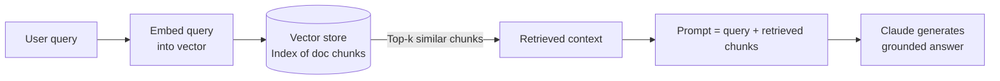

# RAG & Retrieval

← [Tokens & Context](./01-tokens-and-context-window.md) · [→ Next: How Claude Thinks](./03-how-claude-thinks.md)

---

## Core concept

> **RAG (Retrieval-Augmented Generation)** is the pattern of fetching relevant external information at query time and injecting it into the model's context before generating a response. It fixes the "stale training data" problem and grounds Claude's answers in real, verifiable, up-to-date sources.

Without RAG, Claude can only answer from what it learned during training. With RAG, Claude can reason over your live documents, databases, and APIs.

---

## How RAG works — end to end



### Step-by-step

1. **Ingest**: Documents are split into chunks (e.g., 512 tokens each) and converted to vectors (embeddings) stored in a vector database.
2. **Query time**: The user's query is also embedded into the same vector space.
3. **Similarity search**: The vector store returns the top-k chunks whose vectors are closest to the query vector (cosine similarity or similar metric).
4. **Augment**: Retrieved chunks are inserted into the prompt as context.
5. **Generate**: Claude reads the retrieved context and generates an answer grounded in it.

---

## Key concepts

### Embeddings
A numerical representation of text that captures semantic meaning. Similar concepts produce similar vectors.

```
"refund policy" → [0.23, -0.87, 0.14, ...]   (384 or 1536 dimensions)
"return guidelines" → [0.21, -0.84, 0.17, ...] (very close → will be retrieved together)
"quantum physics" → [-0.71, 0.33, -0.52, ...]  (far away → won't be retrieved for refund queries)
```

### Chunking strategy
How you split documents before indexing affects retrieval quality:
- **Too large**: Retrieved chunk contains too much irrelevant text → wastes context.
- **Too small**: Retrieved chunk loses surrounding context needed to answer the question.
- Common: 256–512 tokens per chunk with 10–20% overlap between adjacent chunks.

### Vector similarity search
The retrieval step — find the k document chunks whose embedding vectors are most similar to the query vector. Common metrics: cosine similarity, dot product.

---

## How RAG maps to Claude's exam topics

The CCA-F exam doesn't test RAG directly, but the same concepts appear throughout:

| RAG concept | How it appears in the exam |
|-------------|---------------------------|
| Injecting retrieved context | Subagents pass findings explicitly to synthesis agent in their prompt |
| Chunking for relevance | Upstream agents return structured summaries, not full documents |
| Source attribution | Subagents return claim-source mappings alongside findings |
| Vector stores | MCP tools that search knowledge bases (search tools in the agent system) |
| Tool-as-retriever | The Claude Tool Use API is the mechanism for retrieval at runtime |

---

## RAG in the context of Claude's Tool Use

In practice, RAG with Claude looks like this:

```python
tools = [
    {
        "name": "search_knowledge_base",
        "description": "Searches the product documentation for relevant information. Returns top-3 matching passages with source URLs.",
        "input_schema": {
            "type": "object",
            "properties": {
                "query": {"type": "string", "description": "The search query"}
            }
        }
    }
]
```

Claude calls `search_knowledge_base` → your code runs the vector search → returns top-k chunks → Claude reads them and generates a response. This is the agentic loop pattern applied to retrieval.

---

## Common failure modes

| Failure | Cause | Fix |
|---------|-------|-----|
| Hallucinated citations | Retrieved chunks don't contain the claimed source | Return structured `{claim, source_url, excerpt}` from retrieval tool |
| Irrelevant chunks retrieved | Query embedding doesn't match document embedding well | Better chunking strategy; query reformulation |
| Context overflow | Too many/large chunks retrieved | Limit to top-3 chunks; summarise before injecting |
| Stale results | Index not updated | Incremental re-indexing pipeline |

---

## Related topics

- [Tokens & Context Window](./01-tokens-and-context-window.md) — why retrieved content must be trimmed
- [Tool Descriptions](../02-Tool-Design-and-MCP/01-tool-descriptions.md) — how to describe search tools clearly
- [Information Provenance](../05-Context-and-Reliability/06-information-provenance.md) — preserving source attribution through synthesis
