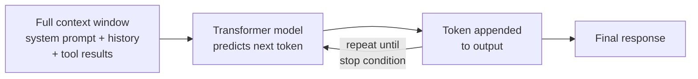

# How Claude Thinks

← [RAG & Retrieval](./02-rag-and-retrieval.md) · [→ Next: Model Selection](./04-model-selection.md)

---

## Core concept

> Claude is a **large language model** — a transformer-based neural network trained to predict the next token given all previous tokens. It does not "look things up," execute code internally, or reason like a human. It generates responses token-by-token, where each token is influenced by everything in the context window. Every response is **probabilistic**, not deterministic.

Understanding this helps you understand why certain prompt patterns work and others don't.

---

## What happens when Claude responds



- Claude generates one token at a time, left to right.
- Each token is influenced by all previous tokens (via attention).
- There is no "planning" step — reasoning happens through the generation process itself.
- The same prompt can produce different outputs on different runs (unless temperature = 0).

---

## How Token Prediction Works — Concrete Example

### What is a Token?

A token is a chunk of text the model's vocabulary recognizes — a word, part of a word, punctuation, or a space. Every piece of text (input and output) is broken into tokens before the model processes it.

The sentence `"How can you help me pass the Claude Code Certified exam"` tokenizes to roughly:
```
"How" | "can" | "you" | "help" | "me" | "pass" | "the" | "Claude" | "Code" | "Certified" | "exam"
```
Internally each token is converted to a number (its vocabulary ID), so the model receives something like:
```
[1128, 460, 345, 1037, 502, 1522, 262, 36579, 6127, 17563, 8435]
```

### One Token at a Time

Claude does **not** write the full response at once. The loop:

1. Feed in full context (system prompt + user message + tokens already generated)
2. Model outputs a probability distribution over all possible next tokens
3. One token is sampled from that distribution
4. That token is appended to the context
5. Repeat from step 1 — until a special `[END]` token is predicted

### Worked Example

**User says:** `"How can you help me pass the Claude Code Certified exam?"`

```
Step 1:  predict "I"          → context: [system prompt + user message]
Step 2:  predict "can"        → context: [...+ "I"]
Step 3:  predict "help"       → context: [...+ "I can"]
Step 4:  predict "you"        → context: [...+ "I can help"]
Step 5:  predict "prepare"    → context: [...+ "I can help you"]
Step 6:  predict "for"        → context: [...+ "I can help you prepare"]
Step 7:  predict "the"        → context: [...+ "I can help you prepare for"]
Step 8:  predict "Claude"     → context: [...+ "...for the"]
Step 9:  predict "Code"       → context: [...+ "...for the Claude"]
Step 10: predict "Certified"  → context: [...+ "...for the Claude Code"]
Step 11: predict "exam"       → context: [...+ "...for the Claude Code Certified"]
Step 12: predict "in"         → context: [...+ "...exam"]
Step 13: predict "several"    → context: [...+ "...exam in"]
Step 14: predict "ways"       → context: [...+ "...exam in several"]
Step 15: predict [END]        → generation stops
```

Final output: `"I can help you prepare for the Claude Code Certified exam in several ways"`

### Key Things to Remember

- **It's one token at a time, always.** The model never plans the full sentence ahead — it only answers: *"given everything before this moment, what is the most likely next token?"*
- **Once a token is predicted, it's locked in.** That token becomes part of the context for all future predictions. There is no going back.
- **This same mechanism applies during tool use.** When Claude decides which tool to call in an agentic loop, it is still predicting tokens one by one — those tokens just form a structured tool-call JSON instead of plain English.

> **Quick mental model**: Think of it like a very smart phone keyboard autocomplete — except instead of suggesting the next word based on frequency, Claude suggests the next token based on deep understanding of meaning, reasoning, and the entire conversation context.

---

## Temperature

Controls how "creative" or "random" the output is.

| Temperature | Behaviour | Use case |
|------------|-----------|----------|
| 0.0 | Near-deterministic, most likely tokens always chosen | Structured output, JSON extraction, factual tasks |
| 0.3–0.7 | Balanced | Most conversation tasks |
| 1.0+ | Creative, varied, sometimes surprising | Creative writing, brainstorming |

> **Exam implication**: For CI/CD pipelines that need consistent structured output, low temperature (or tool_use with JSON schema) is preferred over hoping for stable free-form text.

---

## Chain-of-Thought (CoT)

Claude "thinks through" problems by generating intermediate reasoning steps before giving a final answer. This is not a separate process — it's just Claude writing its reasoning as tokens before writing the conclusion.

Why it works: by generating `"Step 1... Step 2... Therefore..."`, each reasoning step becomes part of the context, and subsequent tokens are conditioned on that reasoning.

**How to elicit CoT:**
- `"Think step by step before answering."`
- `"Show your reasoning."`
- Few-shot examples that demonstrate step-by-step reasoning.

**Extended Thinking**: Claude 3.7+ has an explicit "thinking" mode where reasoning happens in a separate, hidden scratchpad before the visible response. This is more reliable than prompting for CoT.

---

## Why Claude gets things wrong

| Failure mode | Root cause |
|-------------|-----------|
| Hallucination | Model fills in plausible-sounding but fabricated details when actual information is absent from context |
| Inconsistency across runs | Probabilistic generation; small context differences → different outputs |
| "Lost in the middle" | Attention is stronger at start and end of context; middle content may be underweighted |
| Following instructions imperfectly | Prompt-based instructions are probabilistic; ~95-99% reliable, not 100% |
| Deviation from format | If not reinforced with examples or schema constraints, format adherence degrades on complex inputs |

---

## Probabilistic vs deterministic compliance

This is a key exam concept. Prompt instructions guide behaviour but don't guarantee it.

```
Prompt instruction: "Always call get_customer before lookup_order"
→ Claude follows this ~97% of the time
→ In 3% of cases (complex inputs, ambiguous context), it may skip it

Programmatic enforcement (hook/prerequisite gate):
→ lookup_order is blocked at the API level until get_customer returns a verified ID
→ 100% compliance, regardless of Claude's response
```

> **Rule**: For safety-critical or compliance-critical workflows, use **programmatic enforcement** (hooks, prerequisite gates). Use prompts for preference and style, not guarantees.

---

## Memory and persistence

Claude has no persistent memory between API calls by default.

| What Claude remembers | How |
|-----------------------|-----|
| Within a single API call | Everything in the context window |
| Across turns in a conversation | You must include prior turns in the `messages` array each call |
| Across sessions | You must explicitly store and re-inject (CLAUDE.md, database, files) |
| Between subagents | Coordinator must pass context explicitly in each subagent's prompt |

---

## Related topics

- [The Agentic Loop](../01-Agentic-Architecture/01-agentic-loop.md) — how Claude's response drives tool execution
- [Structured Output & JSON Schemas](../04-Prompt-Engineering/03-structured-output-json-schemas.md) — enforcing deterministic output format
- [Agent SDK Hooks](../01-Agentic-Architecture/05-agent-sdk-hooks.md) — programmatic enforcement vs prompt guidance
