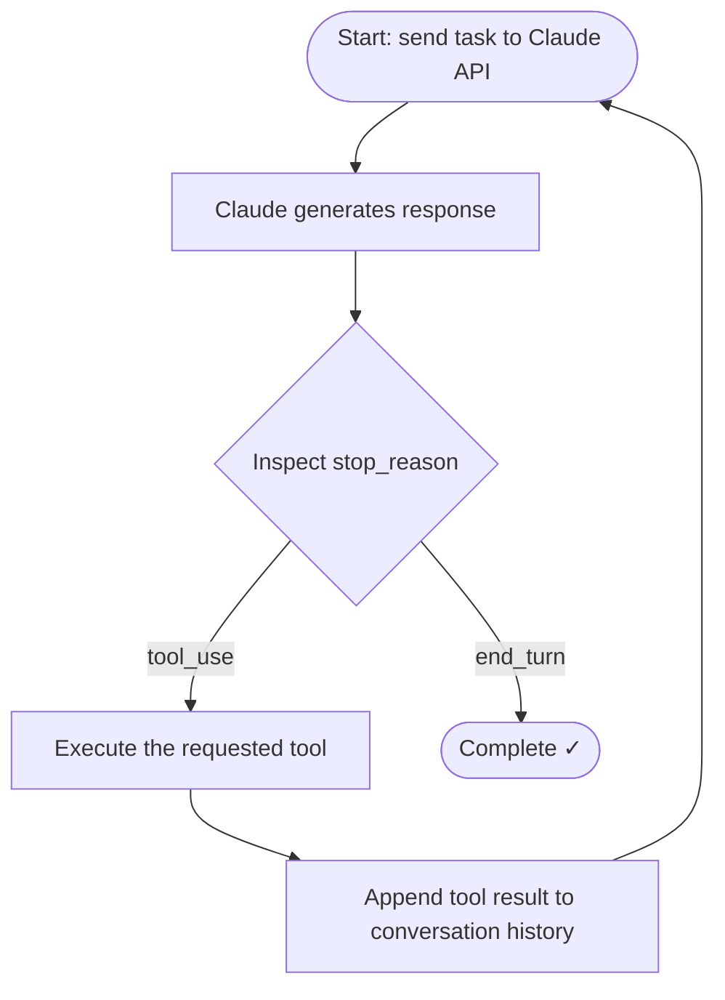

# The Agentic Loop

← [Domain 1 index](./README.md) · [→ Next: Multi-Agent Coordinator](./02-multi-agent-coordinator.md)

---

## Core concept

> The **agentic loop** is the fundamental execution pattern for autonomous Claude agents. Claude receives a task, inspects what it needs, calls tools to gather information or take actions, incorporates those results into its context, and continues until it decides the task is complete. Claude drives the loop — it decides which tools to call and when to stop.

This is not a pre-scripted sequence. Claude reasons about each step based on accumulated context.

---

## The loop in full



### What happens at each step

| Step | What you do | Why it matters |
|------|-------------|----------------|
| Send request | Include system prompt, task, prior history | Claude needs full context every call |
| Inspect `stop_reason` | Check API response field | Tells you whether Claude wants a tool or is done |
| Execute tool | Your code runs the tool Claude requested | Claude cannot execute tools itself |
| Append result | Add `{"role": "tool", ...}` message to history | Claude needs the result to reason about the next step |
| Repeat | Loop back to API call | Continue until `end_turn` |

---

## stop_reason values

| Value | Meaning | Your action |
|-------|---------|------------|
| `"tool_use"` | Claude wants to call one or more tools | Execute them, append results, call API again |
| `"end_turn"` | Claude has finished the task | Stop the loop, return result to user |
| `"max_tokens"` | Output was cut off by token limit | Handle gracefully — may indicate need for a larger context budget |
| `"stop_sequence"` | A custom stop string was hit | Depends on your configuration |

---

## Tool result format

```json
{
  "role": "user",
  "content": [
    {
      "type": "tool_result",
      "tool_use_id": "toolu_01abc...",
      "content": "Order #12345 found. Status: shipped. Expected delivery: 2026-06-03."
    }
  ]
}
```

This goes back in the `messages` array before the next API call. Without it, Claude doesn't know what the tool returned.

---

## What Claude decides vs what you decide

| Claude decides | You decide |
|---------------|-----------|
| Which tool to call next | Which tools are available |
| What arguments to pass | How each tool is implemented |
| Whether to call multiple tools | Loop termination (when `end_turn`) |
| When the task is complete | Safety caps and timeouts |

---

## Anti-patterns to avoid

### ❌ Parsing natural language to detect completion
```python
# WRONG
if "task complete" in response.content[0].text:
    break
```
Claude might phrase completion differently. Always use `stop_reason`.

### ❌ Iteration cap as primary stop mechanism
```python
# WRONG
for i in range(10):  # arbitrary cap
    response = call_claude()
```
Use a cap as a **safety guard**, but the primary termination is `stop_reason == "end_turn"`.

### ❌ Not appending tool results
If you call a tool but don't append the result before the next API call, Claude doesn't know what happened and will likely call the same tool again or generate an incorrect response.

---

## ⚠️ Exam traps

| Wrong answer pattern | Correct approach |
|---------------------|-----------------|
| "Check assistant response text for completion signal" | Always check `stop_reason` |
| "Set iteration limit as the main stopping condition" | Iteration cap = safety net only; `end_turn` is the primary stop |
| "Send each tool call as a separate API request without history" | All history must be included in every API call — Claude has no memory between calls |

---

## Related topics

- [Multi-Agent Coordinator](./02-multi-agent-coordinator.md) — running multiple loops in a coordinated system
- [Agent SDK Hooks](./05-agent-sdk-hooks.md) — intercepting tool calls in the loop
- [How Claude Thinks](../00-Foundations/03-how-claude-thinks.md) — why Claude generates tool calls the way it does
