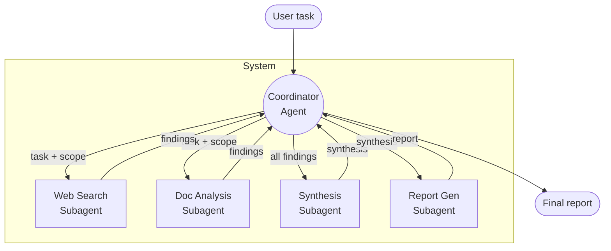

# Multi-Agent Coordinator Pattern

← [Agentic Loop](./01-agentic-loop.md) · [→ Next: Subagent Context Passing](./03-subagent-context-passing.md)

---

## Core concept

> In a **multi-agent system**, a **coordinator agent** acts as the hub. It receives the user's task, decomposes it, delegates subtasks to specialised **subagents**, aggregates their results, and returns the final output. All inter-agent communication routes through the coordinator — subagents never communicate directly with each other.

This hub-and-spoke architecture gives you observability, consistent error handling, and controlled information flow.

---

## Architecture diagram



---

## Coordinator responsibilities

| Responsibility | Description |
|---------------|-------------|
| **Task decomposition** | Break the user's request into subtasks appropriate for each subagent |
| **Scope partitioning** | Assign distinct, non-overlapping research areas to each subagent upfront |
| **Delegation** | Invoke subagents with the Task tool, passing all needed context explicitly |
| **Result aggregation** | Collect findings from all subagents before passing to synthesis |
| **Error handling** | Decide how to recover when a subagent fails or returns partial results |
| **Observability** | Because all communication routes through coordinator, you can log every step |

---

## Critical rules

### 1. Subagents have isolated context
Subagents do **not** inherit the coordinator's conversation history. Each subagent starts fresh — you must pass everything it needs in its prompt.

```
❌ Subagent: "Based on our earlier discussion, search for..."
   → The subagent has no "earlier discussion". It sees only what the coordinator sent.

✅ Coordinator prompt to subagent:
   "You are a web search specialist. Research topic: {topic}.
   Focus specifically on: {assigned_scope}.
   Return: structured findings with source URLs."
```

### 2. Partition scope upfront — don't dedup after
When multiple subagents could cover the same territory (e.g., web search and document analysis both investigating AI trends), tell them their boundaries before they start.

```
❌ Let both agents work freely → collect overlapping results → coordinator deduplicates
   → Wastes tokens, time, and money; synthesis quality suffers

✅ Coordinator assigns:
   Web Search: "Focus on news articles and blog posts from 2025-2026"
   Doc Analysis: "Focus on academic papers and technical reports in the provided document set"
```

### 3. All routing through coordinator
Never have Agent A send results directly to Agent B. This breaks observability and error recovery.

```
❌ Doc Analysis → directly sends → Synthesis
   → Coordinator can't track completion, can't retry on failure

✅ Doc Analysis → returns to Coordinator
   Coordinator → passes all findings to Synthesis
```

---

## Parallel vs sequential subagent execution

**Parallel**: Coordinator emits multiple Task tool calls in a single response. Subagents run concurrently. Use when subagents are independent (web search and doc analysis don't need each other's results).

**Sequential**: Coordinator waits for one subagent to complete before invoking the next. Use when subagent B needs subagent A's output (e.g., synthesis needs search results).

Typical research system pattern:
```
Phase 1 (parallel): Web Search + Doc Analysis run simultaneously
Phase 2 (sequential): Synthesis receives BOTH results, then Report Gen receives synthesis
```

---

## Handling partial results

When a subagent fails or times out, the coordinator must decide:
- **Retry**: Appropriate for transient failures (timeouts, temporary service unavailability)
- **Skip**: Acceptable for non-critical sources when coverage is sufficient
- **Fail the whole task**: Only when the failed subagent's output is essential

The coordinator makes this decision — subagents should not make autonomous retry decisions on behalf of the system. (But subagents CAN retry transient errors locally before escalating to the coordinator.)

---

## ⚠️ Exam traps

| Wrong answer | Correct answer |
|-------------|---------------|
| "Allow agents to complete, then have coordinator dedup overlapping results" | Coordinator partitions scope upfront |
| "Have Document Analysis send results directly to Synthesis to reduce latency" | All routing through coordinator — breaks observability if bypassed |
| "Subagents automatically inherit coordinator's conversation history" | Subagents are isolated — context must be passed explicitly every time |
| "Coordinator should validate all documents before dispatching" | Subagents handle their own local error recovery; only escalate what they can't resolve |

---

## Related topics

- [Subagent Context Passing](./03-subagent-context-passing.md) — how to pass context to subagents correctly
- [Error Propagation](../05-Context-and-Reliability/03-error-propagation.md) — how errors should flow back to coordinator
- [Agentic Loop](./01-agentic-loop.md) — the loop that each agent (coordinator and subagents) runs internally
