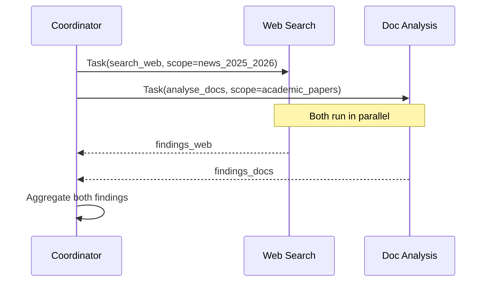
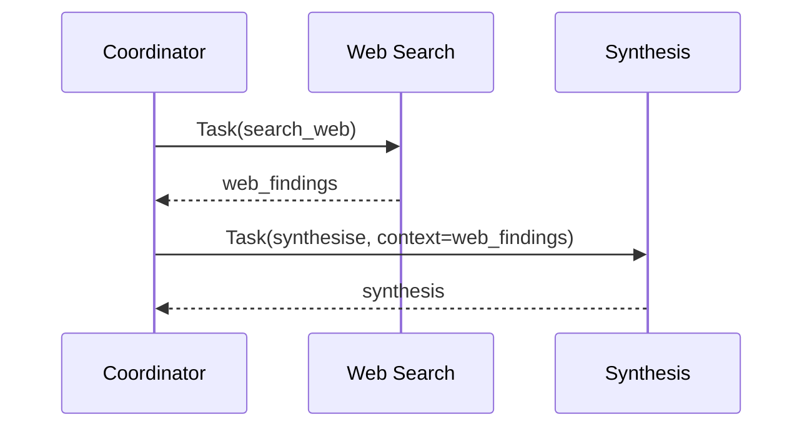

# Subagent Context Passing & Spawning

← [Coordinator Pattern](./02-multi-agent-coordinator.md) · [→ Next: Multi-Step Workflows](./04-multi-step-workflows.md)

---

## Core concept

> Subagents are stateless workers. They receive a prompt, execute their task using their assigned tools, and return results. They have **no memory** of previous subagent invocations, no access to the coordinator's conversation history, and no shared state with sibling subagents. Every piece of context they need must be **explicitly included in the prompt** the coordinator sends them.

---

## The Task tool

The Task tool is the mechanism the coordinator uses to spawn a subagent. For a coordinator to invoke subagents, `"Task"` must be in its `allowedTools`.

```python
# Coordinator's tool list must include Task
coordinator = Agent(
    system_prompt="You are a research coordinator...",
    allowed_tools=["Task", "synthesize_report"]  # Task enables spawning
)
```

When the coordinator calls the Task tool:
```json
{
  "name": "Task",
  "input": {
    "description": "Search for academic papers on AI in creative industries (2023-2026)",
    "prompt": "You are a web search specialist...\n\nTask: {full task description}\nConstraints: {assigned scope}\nReturn format: {expected output structure}"
  }
}
```

---

## What to include in a subagent's prompt

Since subagents have no inherited context, their prompt must be self-contained:

```
✅ Complete subagent prompt includes:
   1. Role/identity ("You are a document analysis specialist")
   2. The full task ("Analyse the following documents for findings about X")
   3. Assigned scope ("Focus only on: academic sources. Do NOT search the web.")
   4. Expected output format ("Return structured JSON: {claim, source_url, confidence}")
   5. Any prior findings they need ("The web search found: {prior_results}")
   6. Error handling instructions ("If a document is corrupted, skip it and note it")
```

---

## Passing context between agents

When the synthesis subagent needs web search results AND document analysis results, the coordinator must explicitly pass both in the synthesis prompt:

```
❌ Wrong: "Here are the research findings" (vague — synthesis doesn't know what was searched or analysed)

✅ Correct:
"Web Search Agent findings (searched: Google Scholar, industry blogs, 2025-2026):
  [structured findings with source URLs]

Document Analysis Agent findings (analysed: 15 uploaded PDFs):
  [structured findings with document names]

Task: Synthesise these findings into a unified report. Preserve all source attributions."
```

---

## Structured data vs raw content

When passing findings between agents, prefer structured data over prose:

| ❌ Raw content | ✅ Structured data |
|--------------|-----------------|
| Full 40KB HTML page | `{title, key_facts: [], source_url, published_date}` |
| Complete PDF text | `{document_name, page_refs, relevant_excerpts: [], claims: []}` |
| Narrative summary | `{finding, confidence, source, contradicts: [other_finding_id]}` |

Structured data: smaller, preserves attribution, easier for downstream agents to process.

---

## Parallel spawning

Spawn multiple subagents in one coordinator response by emitting multiple Task tool calls simultaneously:



Sequential (when B needs A's output):


---

## Tool restriction per subagent

Each subagent should have access only to the tools it needs for its role:

| Subagent | Allowed tools | NOT allowed |
|----------|--------------|------------|
| Web Search | `search_web`, `fetch_url` | `process_refund`, `delete_document` |
| Doc Analysis | `read_document`, `extract_sections` | `search_web` (use a scoped `fetch_document` instead) |
| Synthesis | `verify_claim` | `search_web` (routes complex searches back through coordinator) |

**Why**: Giving an agent tools outside its specialisation causes misuse. A synthesis agent with `search_web` access will start conducting ad-hoc research instead of synthesising.

Replace generic tools with scoped alternatives: `fetch_url` → `fetch_document` (validates that the URL points to a document, not a search page).

---

## Fork-based session management

`fork_session` creates an independent branch from a shared analysis baseline. Use when exploring multiple divergent approaches from the same starting point (e.g., comparing two different testing strategies for the same codebase).

---

## ⚠️ Exam traps

| Wrong answer | Correct answer |
|-------------|---------------|
| "Subagents automatically see coordinator's prior conversation" | Must pass context explicitly in every Task prompt |
| "Give synthesis agent access to search_web for inline verification" | Give it a scoped `verify_claim` tool; route full searches through coordinator |
| "Have each subagent send results to coordinator and then to the next subagent" | Coordinator aggregates all results before passing to synthesis |
| "Use fetch_url for document analysis" | Replace with `fetch_document` — scoped to document URLs, prevents ad-hoc web search |

---

## Related topics

- [Multi-Agent Coordinator](./02-multi-agent-coordinator.md) — coordinator responsibilities and partitioning
- [Tool Distribution & tool_choice](../02-Tool-Design-and-MCP/03-tool-distribution-and-choice.md) — configuring tool access per agent
- [Error Propagation](../05-Context-and-Reliability/03-error-propagation.md) — how subagents should return errors
