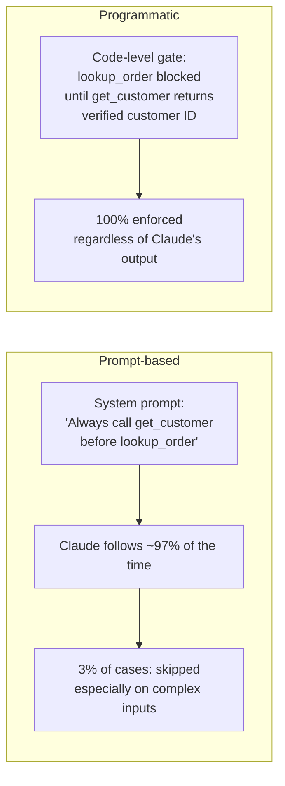
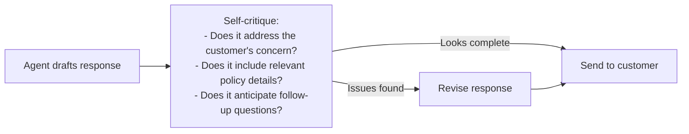

# Multi-Step Workflows & Enforcement

← [Subagent Context Passing](./03-subagent-context-passing.md) · [→ Next: Agent SDK Hooks](./05-agent-sdk-hooks.md)

---

## Core concept

> Some workflows require steps to happen in a specific order — for example, verifying a customer's identity before processing a refund. There are two ways to enforce ordering: **prompt-based guidance** (tell Claude what to do) and **programmatic enforcement** (block actions at the code level). For critical business logic, only programmatic enforcement provides a guarantee.

---

## Prompt guidance vs programmatic enforcement



| Method | Reliability | Use for |
|--------|-------------|---------|
| Prompt instruction | ~95–99% | Preferences, style, soft guidelines |
| Programmatic gate / hook | 100% | Safety-critical order, financial operations, compliance |

---

## Prerequisite gates

A prerequisite gate blocks a downstream tool from being called until a required upstream step completes and returns a valid result.

**Example: Customer support agent**
```
Process:
  Step 1: get_customer(identifier) → returns verified_customer_id
  Step 2: lookup_order(order_id, verified_customer_id) → allowed only after Step 1
  Step 3: process_refund(amount, verified_customer_id) → allowed only after Step 1

Gate: lookup_order and process_refund check that get_customer has been called
      and returned a verified_customer_id in this session. If not → blocked.
```

This prevents Claude from ever calling `process_refund` on a guessed or unverified customer ID, even if its reasoning is confused.

---

## Decomposing multi-concern requests

When a customer says "I have three issues — a missing item, a billing overcharge, and I want to update my address":

```
❌ Handle all three in sequence, one by one
   → Slow, each investigation is isolated from others

✅ Decompose into three parallel investigation tracks:
   Track A: lookup_order(missing_item_order_id) → find missing item status
   Track B: get_billing_history() → find overcharge details
   Track C: confirm_address_update() → check update requirements
   → Run all three with shared customer context
   → Synthesise unified resolution at the end
```

---

## Structured handoff protocols

When an agent needs to escalate to a human (or another agent), it must compile a **structured handoff summary** — not just "I can't handle this."

**Why**: The human agent receiving the escalation has no access to the conversation transcript.

```
✅ Handoff structure:
{
  "customer_id": "C-89234",
  "customer_name": "Jane Smith",
  "issue_summary": "Billing dispute: charged twice for order #55123 on 2026-05-15",
  "investigation_completed": ["verified customer identity", "confirmed duplicate charge"],
  "investigation_pending": ["refund eligibility check (requires manager approval >$200)"],
  "recommended_action": "Approve $67.99 refund for duplicate charge",
  "relevant_order_ids": ["#55123"],
  "escalation_reason": "Refund amount exceeds automated approval threshold"
}
```

---

## Pattern: self-critique step

For complex customer support responses where quality is critical, add a self-critique step before sending:



> **Key insight**: Self-critique is more effective at catching completeness gaps than few-shot examples, because few-shot examples only cover the cases you anticipated. Self-critique applies to any situation.

---

## ⚠️ Exam traps

| Wrong answer | Correct answer |
|-------------|---------------|
| "Add few-shot examples showing agent always calling get_customer first" | Programmatic prerequisite gate — prompt-based is unreliable for critical ordering |
| "Enhance system prompt to state verification is mandatory" | Prompt instructions fail in edge cases; use programmatic enforcement |
| "Handle multi-concern requests sequentially one by one" | Decompose and investigate in parallel using shared context |
| "Add a confirmation step asking 'Does this address your concern?'" | Self-critique step (agent evaluates its own draft) is more effective |

---

## Related topics

- [Agent SDK Hooks](./05-agent-sdk-hooks.md) — the implementation mechanism for programmatic enforcement
- [How Claude Thinks](../00-Foundations/03-how-claude-thinks.md) — why prompt instructions are probabilistic
- [Escalation Patterns](../05-Context-and-Reliability/02-escalation-patterns.md) — when and how to escalate to humans
