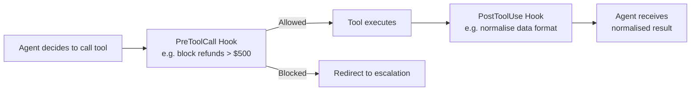

# Agent SDK Hooks

← [Multi-Step Workflows](./04-multi-step-workflows.md) · [→ Next: Task Decomposition](./06-task-decomposition.md)

---

## Core concept

> **Hooks** are interceptors that run at specific points in the agentic loop — before a tool is called or after a tool returns. They let you apply **deterministic, programmatic logic** without relying on Claude's probabilistic reasoning. Hooks are the mechanism for guaranteed compliance with business rules.

---

## Hook types



| Hook | When it runs | Use case |
|------|-------------|---------|
| `PreToolCall` | Before the tool executes | Validate, block, or redirect tool calls |
| `PostToolUse` | After the tool returns, before agent sees the result | Transform, normalise, or enrich tool output |

---

## PostToolUse — data normalisation

**Problem**: Your MCP tools return data in different formats:
- `get_customer` returns Unix timestamps (`1717200000`)
- `lookup_order` returns ISO 8601 dates (`"2024-06-01T10:00:00Z"`)
- Order status is numeric code (`1 = pending, 2 = shipped, 3 = delivered`)

Claude must interpret these consistently. If it misreads a timestamp or status code, it may give incorrect information to the customer.

**Solution**: PostToolUse hook normalises all tool outputs to a consistent format before Claude sees them.

```python
def post_tool_use_hook(tool_name, tool_result):
    if tool_name == "get_customer":
        # Convert Unix timestamp to readable date
        tool_result["created_at"] = datetime.fromtimestamp(
            tool_result["created_at"]
        ).strftime("%Y-%m-%d")

    if tool_name == "lookup_order":
        # Convert numeric status code to string
        status_map = {1: "pending", 2: "shipped", 3: "delivered"}
        tool_result["status"] = status_map.get(tool_result["status"], "unknown")

    return tool_result
```

Claude always receives clean, human-readable data — regardless of what format the underlying tools return.

> **Why a hook and not a wrapper tool?** Third-party MCP tools can't be modified. Hooks intercept any tool's output, including ones you don't control.

---

## PreToolCall — policy enforcement

**Problem**: You need to ensure refunds above $500 are never processed automatically — they must always go to a human agent.

**With prompt instruction**: Claude follows this ~97% of the time. On edge cases (ambiguous amounts, multi-currency, complex refund chains), it may process incorrectly.

**With PreToolCall hook**:
```python
def pre_tool_call_hook(tool_name, tool_args):
    if tool_name == "process_refund":
        amount = tool_args.get("amount", 0)
        if amount > 500:
            # Block the refund tool call entirely
            # Return an error that tells Claude to escalate instead
            raise PolicyViolationError(
                "Refund amount $%.2f exceeds automated approval threshold ($500). "
                "Use escalate_to_human tool instead." % amount
            )
    return tool_args  # Allow the call to proceed
```

This guarantees no refund above $500 goes through, no matter what Claude's reasoning produces.

---

## Hooks vs prompt instructions: choosing the right one

| Scenario | Use prompt instruction | Use hook |
|----------|----------------------|---------|
| "Usually format dates as YYYY-MM-DD" | ✅ Style preference | |
| "Never process refunds above $500" | | ✅ Business rule, must be guaranteed |
| "Prefer lookup_order over get_customer for order queries" | ✅ Routing preference | |
| "Always call get_customer before process_refund" | | ✅ Safety-critical ordering |
| "Normalise data from third-party tools we can't modify" | | ✅ Data transformation |
| "Be polite in responses" | ✅ Style | |

**Rule of thumb**: If a violation would cause harm (financial, legal, security), use a hook. If it would cause inconvenience or inconsistency, a prompt instruction is usually sufficient.

---

## ⚠️ Exam traps

| Wrong answer | Correct answer |
|-------------|---------------|
| "Add a normalize_data tool that Claude calls after each retrieval" | PostToolUse hook — more reliable, Claude doesn't need to remember to call it |
| "Add system prompt instruction to always convert timestamps" | Hook — Claude will miss this on complex inputs; hook is deterministic |
| "Modify the MCP tools to return human-readable format" | Hook — third-party tools can't be modified; hooks work on any tool |
| "Use prompt instructions to block high-value refunds" | PreToolCall hook — prompt instructions have non-zero failure rate |

---

## Related topics

- [Multi-Step Workflows](./04-multi-step-workflows.md) — prerequisite gates (also a form of enforcement)
- [Tool Distribution & tool_choice](../02-Tool-Design-and-MCP/03-tool-distribution-and-choice.md) — tool_choice for forcing specific tool calls
- [How Claude Thinks](../00-Foundations/03-how-claude-thinks.md) — why prompts are probabilistic
