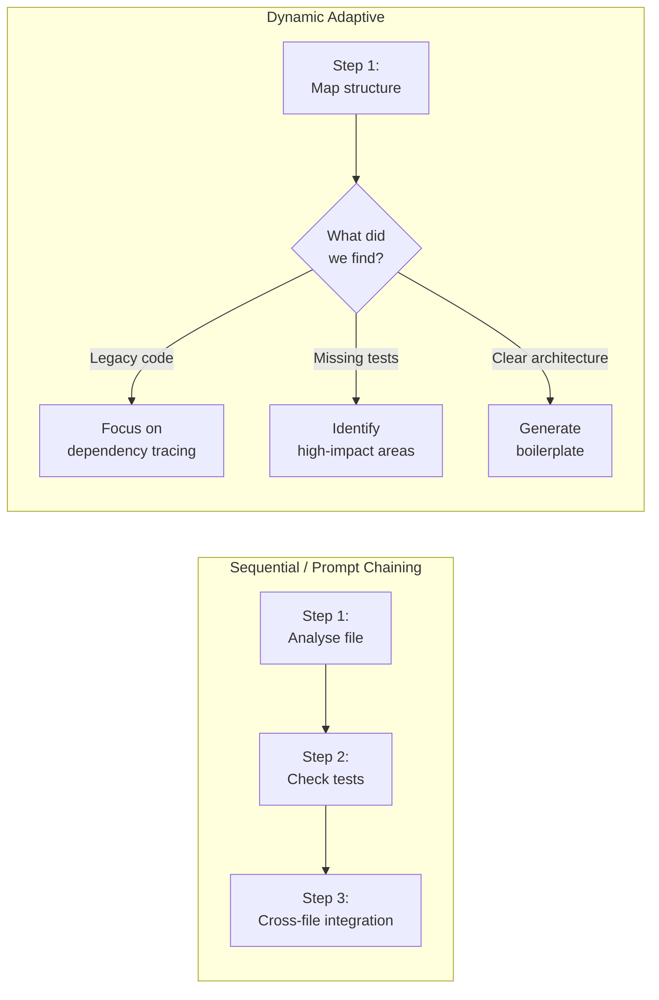

# Task Decomposition Strategies

← [Agent SDK Hooks](./05-agent-sdk-hooks.md) · [→ Next: Session State & Forking](./07-session-state-and-forking.md)

---

## Core concept

> **Task decomposition** is how complex work gets broken into steps Claude can execute reliably. There are two main strategies: **sequential (prompt chaining)** for predictable multi-step tasks, and **dynamic adaptive decomposition** for open-ended tasks where the next step depends on what you find. Choosing the wrong strategy leads to incomplete results or wasted effort.

---

## Two decomposition strategies



---

## Sequential decomposition (prompt chaining)

Break a known multi-step task into fixed stages, where each stage's output feeds the next.

**When to use:**
- Predictable tasks with known steps
- Code review (per-file passes → cross-file integration pass)
- Report generation (research → draft → review → format)
- The task doesn't require branching based on intermediate findings

**Example: Large code review**
```
Stage 1: Per-file local analysis
  → Analyse each of the 14 changed files independently
  → Each pass looks for: security issues, null checks, error handling

Stage 2: Cross-file integration pass
  → Given all local findings, check: are there cross-file data flow issues?
  → Are findings in File A contradicted by logic in File B?

Stage 3: Synthesis
  → Combine local + integration findings into prioritised list
```

**Why split into stages?**
- A single pass over 14 files causes **attention dilution** — the model's attention is spread thin, and it misses things in the middle files.
- Separate stages prevent **contradictory findings** — the integration pass can reconcile conflicts that arose from viewing files in isolation.

---

## Dynamic adaptive decomposition

Generate subtasks based on what you discover at each step. The investigation plan evolves.

**When to use:**
- Open-ended exploration ("add comprehensive tests to this legacy codebase")
- Codebase investigation with unknown structure
- Tasks where the right approach depends on what you find

**Example: Add tests to legacy codebase**
```
Step 1: Map structure
  → Glob for all source files
  → Identify patterns: how is the code organised?

Step 2: Identify high-impact areas (based on Step 1 findings)
  → Which modules have no tests?
  → Which modules are most depended upon?

Step 3: Trace dependencies for high-priority modules
  → Understand what each module does before writing tests

Step 4: Generate prioritised test plan
  → Ordered by impact × risk × effort

Step 5: Execute (may loop back if new dependencies discovered)
```

---

## Avoiding attention dilution

When reviewing many files in a single pass, Claude's attention is spread across all of them. Findings from files in the middle of the context are less reliable than those at the start and end.

**Fix**: Process files in logical groups with separate review passes.

```
❌ "Review all 14 files thoroughly" in one prompt
   → Inconsistent results; some files barely reviewed

✅ Group 1 (authentication module): files 1-4 → dedicated review pass
   Group 2 (payment module): files 5-8 → dedicated review pass
   Group 3 (API layer): files 9-14 → dedicated review pass
   Integration pass: cross-group data flow → separate pass
```

---

## ⚠️ Exam traps

| Wrong answer | Correct answer |
|-------------|---------------|
| "Review all files in one pass with instructions to be thorough" | Process files in logical groups; attention dilution is real |
| "Use sequential pipeline for open-ended legacy codebase work" | Dynamic adaptive decomposition — you don't know the steps until you explore |
| "Use dynamic decomposition for standard code review" | Prompt chaining — the steps are predictable; dynamic adds unnecessary complexity |
| "Sort files alphabetically and process one at a time" | Group by logical module; cross-file relationships matter for ordering |

---

## Related topics

- [Multi-Agent Coordinator](./02-multi-agent-coordinator.md) — coordinator implements decomposition at the multi-agent level
- [CI/CD Integration](../03-Claude-Code-Configuration/06-cicd-integration.md) — applying decomposition in automated pipelines
- [Large Codebase Exploration](../05-Context-and-Reliability/04-large-codebase-exploration.md) — managing context during adaptive decomposition
