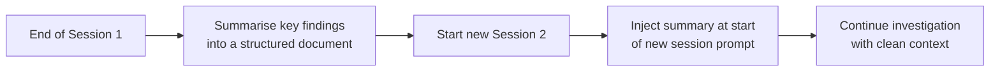
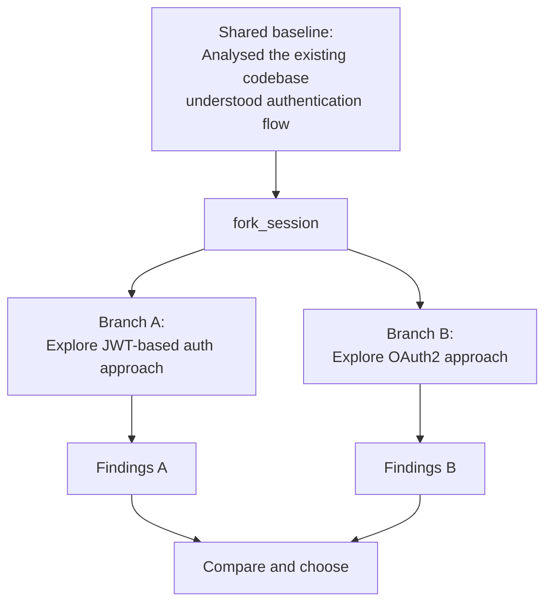

# Session State, Resumption & Forking

← [Task Decomposition](./06-task-decomposition.md) · [→ Domain 2: Tool Design](../02-Tool-Design-and-MCP/README.md)

---

## Core concept

> Claude sessions don't persist automatically between separate runs. If you want to continue a previous investigation, you must either **resume a named session** (when prior context is mostly still valid) or **start fresh with an injected summary** (when prior tool results are stale). For exploring divergent approaches from a shared baseline, use **fork_session**.

---

## Session resumption with `--resume`

```bash
# Start a named session
claude --session-name "refund-flow-investigation"

# Days later, continue it
claude --resume "refund-flow-investigation"
```

**When to resume**: The prior context is still valid — the code you were analysing hasn't changed significantly since the session ended.

**When NOT to resume (start fresh instead)**:
- Files you previously analysed have been modified
- You're getting inconsistent answers (sign of context degradation)
- Prior tool results are stale (e.g., you ran `git pull` and the codebase changed significantly)

When resuming after code changes: tell the agent explicitly which files changed so it can re-analyse them rather than relying on its earlier analysis.

```
"I'm resuming our investigation. Since our last session, these files were modified:
- src/auth/verify.py (added MFA check)
- src/payments/refund.py (changed threshold from $500 to $1000)
Please re-read these files before continuing."
```

---

## Starting fresh with injected summaries

More reliable than resuming when prior tool results are stale:



**Why more reliable**: A new session has clean context with no stale tool results. The injected summary gives Claude accurate, curated information instead of potentially outdated intermediate results.

---

## fork_session — divergent exploration

Create independent branches from a shared analysis baseline to explore different approaches without contaminating each other.



**Use cases**:
- Comparing two implementation strategies without cross-contaminating the contexts
- Exploring a risky refactor in a branch without affecting the main investigation
- A/B testing different prompt approaches for the same task

---

## Context degradation in long sessions

As a session grows long, context quality degrades:
- Model starts giving inconsistent answers
- References "typical patterns" instead of specific code it found earlier
- Earlier tool results compete for attention with newer ones

**Signs of context degradation**:
- Claude says "typically this would be..." instead of citing specific code
- Answers to the same question differ between early and late in the session
- Claude re-explores files it already analysed

**Mitigation strategies**:
1. Use `/compact` to summarise verbose earlier context
2. Have agents maintain **scratchpad files** — write key findings to disk so they survive context limits
3. Start a new session with injected summary of key findings
4. Spawn subagents for specific sub-questions to isolate their verbose output

---

## Scratchpad files for persistence

When a session might span multiple phases or be interrupted, agents should persist findings to files:

```python
# Agent writes key findings to disk after each major step
write_file("investigation_state.json", {
    "modules_analysed": ["auth", "payments", "notifications"],
    "key_findings": {
        "auth": "MFA bypass possible via direct API call",
        "payments": "Refund logic correct but missing audit log"
    },
    "next_steps": ["analyse order module", "check API rate limiting"]
})
```

On resume (or if coordinator crashes), load the manifest:
```python
# Coordinator on startup
state = load_file("investigation_state.json")
remaining = [m for m in all_modules if m not in state["modules_analysed"]]
```

---

## ⚠️ Exam traps

| Wrong answer | Correct answer |
|-------------|---------------|
| "Always resume the previous session for continuity" | If prior tool results are stale (code changed), start fresh with injected summary |
| "Use fork_session to save memory between sessions" | fork_session is for divergent exploration, not persistence across sessions |
| "Continue in the same session through multiple phases by using /compact" | /compact helps but for multi-day investigation, fresh session + summary is more reliable |
| "Don't tell the resumed session about file changes" | Explicitly inform the resumed session which files changed for targeted re-analysis |

---

## Related topics

- [Large Codebase Exploration](../05-Context-and-Reliability/04-large-codebase-exploration.md) — managing context during extended sessions
- [Plan Mode](../03-Claude-Code-Configuration/04-plan-mode.md) — plan mode is a form of structured exploration before execution
- [Multi-Agent Coordinator](./02-multi-agent-coordinator.md) — coordinator crash recovery using state manifests
