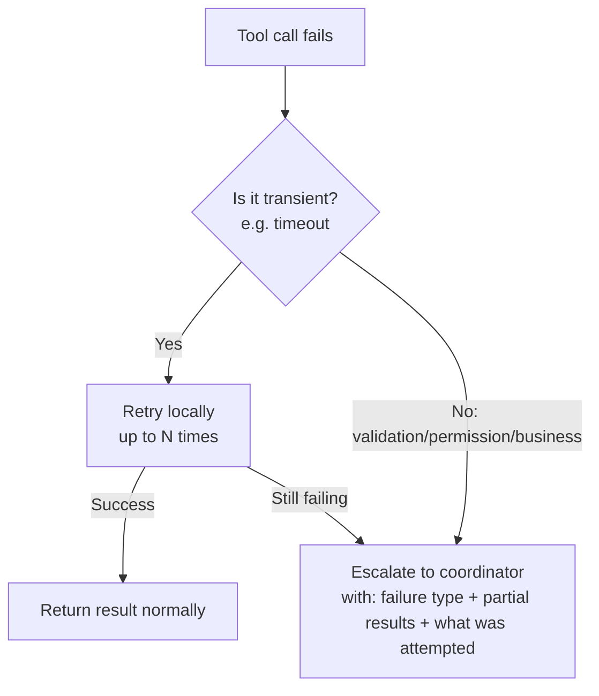

# Structured Error Responses

← [Tool Descriptions](./01-tool-descriptions.md) · [→ Next: Tool Distribution & tool_choice](./03-tool-distribution-and-choice.md)

---

## Core concept

> When a tool fails, the error response must give Claude enough structured information to make a good recovery decision. A generic "Operation failed" tells Claude nothing. A structured error response tells Claude: what type of failure occurred, whether retrying is worthwhile, what partial results are available, and what to communicate to the user.

---

## The MCP isError flag

MCP tools communicate failures using the `isError` flag in their response:

```json
{
  "isError": true,
  "content": [
    {
      "type": "text",
      "text": "..."
    }
  ]
}
```

Without `isError: true`, Claude may treat a failure response as a successful result and act on incorrect data.

---

## Error categories

| Category | Meaning | Agent should |
|----------|---------|-------------|
| **Transient** | Timeout, temporary service unavailability | Retry (with backoff) |
| **Validation** | Invalid input format, missing required field | Do not retry — fix the input |
| **Business** | Policy violation (refund exceeds limit) | Do not retry — escalate or inform user |
| **Permission** | Unauthorised, token expired | Do not retry — escalate or re-authenticate |

---

## What a structured error response looks like

```json
{
  "isError": true,
  "errorCategory": "transient",
  "isRetryable": true,
  "failureType": "timeout",
  "whatWasAttempted": "Searched academic databases for 'AI creative industries 2025'",
  "partialResults": {
    "academicDatabases": "0 results returned",
    "industryReports": "15 results found (returned separately)",
    "patentDatabases": "Connection timeout — no results"
  },
  "suggestedAction": "Retry patent database search; academic and industry results available"
}
```

Claude can now make an informed decision:
- Industry reports: use them (successful)
- Patent database: retry (transient failure)
- Academic databases: valid empty result (not a failure)

---

## Distinguishing failure types — critical exam concept

Not all "no results" situations are errors. This distinction matters enormously for coordinator recovery decisions:

```
Scenario: Web search agent queries 3 source types:
  1. Academic databases → "0 results found"
  2. Industry reports → "15 results found"
  3. Patent databases → "Connection timeout"

❌ Wrong: Report both #1 and #3 as failures requiring coordinator intervention
   → Coordinator wastes time retrying a valid empty search

✅ Correct:
   #1 (0 results): Successful query with no matches — report as valid empty result
   #3 (timeout): Access failure — report as transient error requiring retry decision
```

**Rule**: `"0 results"` = success with no matches. `"Connection timeout"` = access failure. These require different coordinator responses.

---

## Subagent local recovery

Subagents should handle transient failures locally before escalating to the coordinator. Only propagate errors that the subagent genuinely cannot resolve.



The coordinator receives enough context to decide: retry with different parameters? Skip this source? Fail the whole task?

---

## ⚠️ Exam traps

| Wrong answer | Correct answer |
|-------------|---------------|
| "Return simple boolean success: false" | Return structured error: type, retryable flag, partial results, what was attempted |
| "Retry all failures automatically up to 3 times before reporting" | Local retry for transient only; non-retryable errors should escalate immediately |
| "Report '0 results' as a failure" | "0 results" is a successful query with no matches — report separately from access failures |
| "Return generic 'search unavailable' for all failures" | Distinguish the failure type — coordinator needs this to make the right recovery decision |
| "Subagent should always propagate errors directly to coordinator" | Subagents should attempt local recovery for transient failures first |

---

## Related topics

- [Error Propagation](../05-Context-and-Reliability/03-error-propagation.md) — how structured errors flow through multi-agent systems
- [Multi-Agent Coordinator](../01-Agentic-Architecture/02-multi-agent-coordinator.md) — coordinator's role in error recovery decisions
- [Agent SDK Hooks](../01-Agentic-Architecture/05-agent-sdk-hooks.md) — hooks can also intercept and enrich error responses
