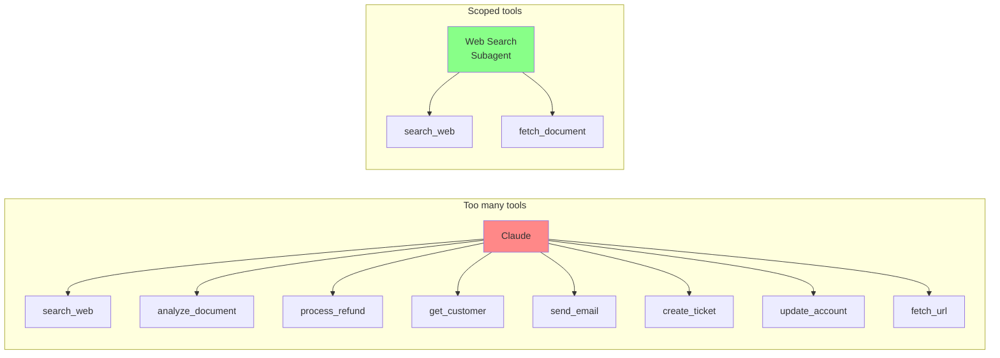

# Tool Distribution & tool_choice

← [Structured Error Responses](./02-structured-error-responses.md) · [→ Next: MCP Server Integration](./04-mcp-server-integration.md)

---

## Core concept

> Giving an agent access to more tools than it needs **degrades its tool selection reliability**. When Claude must choose from 18 tools, it makes worse decisions than when choosing from 4–5. Each agent should receive only the tools necessary for its specific role. The `tool_choice` configuration controls whether tool use is optional, required, or forced to a specific tool.

---

## Tool scoping per agent



**Rule**: Give each agent 4–5 tools maximum. More than that and selection accuracy drops meaningfully.

---

## tool_choice options

The `tool_choice` parameter controls how Claude uses the available tools:

| Option | Behaviour | When to use |
|--------|-----------|------------|
| `"auto"` | Claude may call a tool or return text | Default for most conversations |
| `"any"` | Claude must call a tool (but chooses which one) | When you need guaranteed tool use, not conversational text |
| `{"type": "tool", "name": "extract_metadata"}` | Claude must call this specific named tool | Force a specific step before others |

### tool_choice: "any"

Use when you need to guarantee Claude calls a tool rather than returning a text response. Useful for structured extraction when you have multiple extraction schemas and don't know which document type will appear.

```python
response = client.messages.create(
    model="claude-sonnet-4-6",
    tools=[extract_invoice, extract_receipt, extract_contract],
    tool_choice={"type": "any"},  # Must call one of these; no text-only response
    messages=[{"role": "user", "content": document_content}]
)
```

### Forced tool selection

Force a specific tool to run before others. Use when a prerequisite step must always happen first.

```python
# Phase 1: Force metadata extraction before any enrichment
response = client.messages.create(
    tool_choice={"type": "tool", "name": "extract_metadata"},
    ...
)

# Phase 2: Normal tool use with full tool set
response = client.messages.create(
    tool_choice={"type": "auto"},
    messages=[*prior_messages, metadata_result],
    ...
)
```

---

## Cross-role tools for high-frequency needs

Sometimes a subagent needs limited access to a capability outside its primary role. Instead of routing everything through the coordinator, give the subagent a **scoped cross-role tool**.

**Example**: Synthesis agent frequently needs to verify specific claims while synthesising. Instead of returning to coordinator each time:

```
❌ Synthesis → coordinator → web search subagent → coordinator → synthesis
   (round trip adds latency for every claim verification)

✅ Give synthesis agent a scoped verify_claim tool:
   - Accepts: claim text + source URL
   - Returns: supported / contradicted / insufficient evidence
   - Does NOT allow: free-form web searches
   → Synthesis can verify inline; complex searches still route through coordinator
```

---

## ⚠️ Exam traps

| Wrong answer | Correct answer |
|-------------|---------------|
| "Give agents access to all tools for flexibility" | Each agent gets only tools relevant to its role (4–5 max) |
| "Use tool_choice: 'auto' to guarantee a tool is called" | `"auto"` allows text response; use `"any"` to guarantee tool use |
| "Route all synthesis verifications through coordinator" | Give synthesis a scoped verify_claim tool for inline verification |
| "Consolidate overlapping tools into one general-purpose tool" | Purpose-specific scoped tools; general tools cause misuse |

---

## Related topics

- [Tool Descriptions](./01-tool-descriptions.md) — clear descriptions improve selection even within a scoped set
- [Subagent Context Passing](../01-Agentic-Architecture/03-subagent-context-passing.md) — how to configure tools when spawning subagents
- [Structured Output & JSON Schemas](../04-Prompt-Engineering/03-structured-output-json-schemas.md) — tool_use as the mechanism for guaranteed structured output
