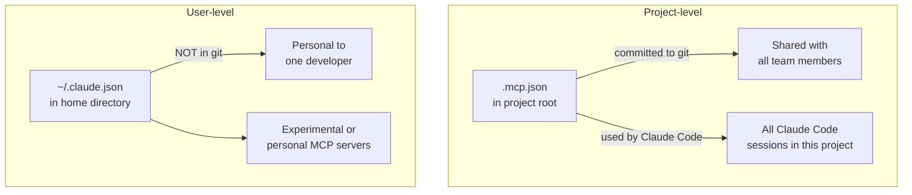

# MCP Server Integration

← [Tool Distribution & tool_choice](./03-tool-distribution-and-choice.md) · [→ Next: Built-in Tools](./05-builtin-tools.md)

---

## Core concept

> **Model Context Protocol (MCP)** is the standard for connecting Claude to external tools and data sources. MCP servers expose tools and resources that Claude can use. The key architectural decision is **scoping**: project-level MCP servers are shared with the team via version control; user-level servers are personal only and never shared.

---

## MCP server scoping



| Scope | Config location | Shared via git? | Use for |
|-------|----------------|----------------|---------|
| Project | `.mcp.json` in project root | ✅ Yes | Team-shared tools (GitHub, Jira, company databases) |
| User | `~/.claude.json` | ❌ No | Personal/experimental servers, private credentials |

---

## Project-level MCP configuration (.mcp.json)

```json
{
  "mcpServers": {
    "github": {
      "command": "npx",
      "args": ["-y", "@modelcontextprotocol/server-github"],
      "env": {
        "GITHUB_TOKEN": "${GITHUB_TOKEN}"
      }
    },
    "company-db": {
      "command": "python",
      "args": ["./mcp/db_server.py"],
      "env": {
        "DB_URL": "${DB_URL}",
        "DB_PASSWORD": "${DB_PASSWORD}"
      }
    }
  }
}
```

**Key points**:
- Credentials use `${ENV_VAR}` expansion — never hardcode tokens in `.mcp.json`
- `.mcp.json` is committed to git; environment variables are not
- All configured MCP server tools are discovered at connection time and available simultaneously

---

## Global vs project MCP installation

```
❌ Global installation (--global flag):
   Makes the server available in ALL Claude Code sessions
   → Available in personal projects, unrelated repos, other teams' work
   → Unnecessary tool access outside the intended context

✅ Project installation (.mcp.json):
   Available only in this project's Claude Code sessions
   → Least-privilege: right access for the right context
```

**Example**: GitHub MCP server for a specific repo. Install it in `.mcp.json` for that project. Don't install it globally — you don't want GitHub access surfacing in every other project you work on.

---

## MCP resources

MCP servers can expose **resources** in addition to tools. Resources are content catalogs — they give Claude visibility into available data without requiring exploratory tool calls.

**Example**: Instead of Claude having to call `list_issues()` to discover what issues exist, the MCP server exposes an issues resource that Claude can read directly.

```
Tool approach: Claude calls list_issues() → gets 200 issues → spends context tokens processing them
Resource approach: Issues resource provides a summary catalog → Claude sees what's available at startup
```

Resources reduce exploratory tool calls and help Claude make better-informed decisions about what to look up.

---

## When to use existing community MCP servers vs custom

| Situation | Recommendation |
|-----------|---------------|
| Standard tool (GitHub, Jira, Slack, Postgres) | Use existing community MCP server |
| Team-specific workflow (company approval API, internal ticketing) | Build custom MCP server |
| Third-party service with standard API | Check MCP registry first; build custom only if nothing exists |

Existing servers are maintained, tested, and save implementation time. Custom servers are for workflows specific to your team that no general server covers.

---

## ⚠️ Exam traps

| Wrong answer | Correct answer |
|-------------|---------------|
| "Install GitHub MCP globally with --global for team access" | Install in project `.mcp.json` — global expands tool access unnecessarily to unrelated projects |
| "Hardcode API tokens in .mcp.json" | Use `${ENV_VAR}` expansion — .mcp.json is committed to git |
| "Use user-level ~/.claude.json for team-shared tools" | User-level is NOT in git; use .mcp.json for team-shared servers |
| "Configure MCP separately for each Claude Code session" | Once in .mcp.json, all tools are available in every session for that project |

---

## Related topics

- [Custom Skills & Slash Commands](../03-Claude-Code-Configuration/02-custom-skills-and-commands.md) — Claude Code's own allowed-tools configuration in skills
- [Tool Distribution & tool_choice](./03-tool-distribution-and-choice.md) — controlling which tools Claude can use
- [CI/CD Integration](../03-Claude-Code-Configuration/06-cicd-integration.md) — MCP servers in automated pipelines
