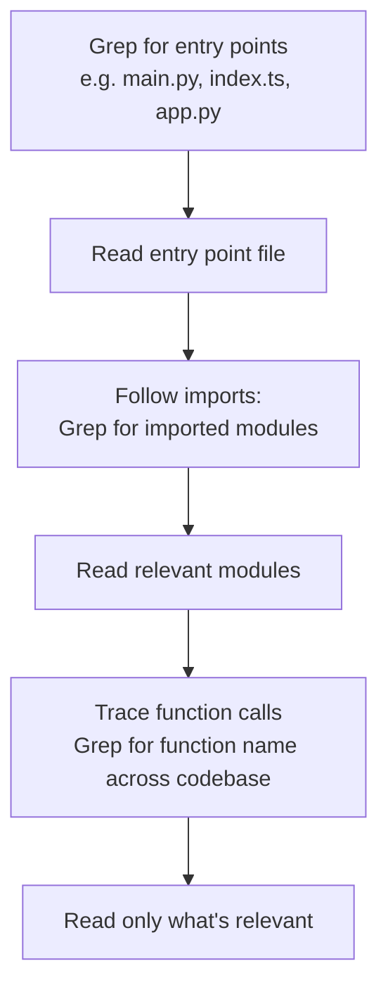

# Built-in Tools — Read / Write / Edit / Bash / Grep / Glob

← [MCP Server Integration](./04-mcp-server-integration.md) · [→ Domain 3: Claude Code Configuration](../03-Claude-Code-Configuration/README.md)

---

## Core concept

> Claude Code has six built-in tools for working with files and code. Each has a specific purpose. Using the wrong tool for a task wastes tokens (reading a whole file when you could grep for one function) or produces unreliable results (Edit failing because the text isn't unique). Knowing when to use each is a tested skill.

---

## Tool reference

| Tool | Purpose | When to use |
|------|---------|------------|
| **Grep** | Search file *contents* by pattern | Finding function definitions, error messages, import statements, all callers of a function |
| **Glob** | Find files by *name pattern* | Finding all test files (`**/*.test.tsx`), all config files, files in a specific directory |
| **Read** | Load full file contents | Understanding a specific file; loading before editing; following imports |
| **Write** | Create or fully overwrite a file | New file creation; complete file rewrites |
| **Edit** | Targeted text replacement in a file | Modifying a specific function/section without rewriting the whole file |
| **Bash** | Execute shell commands | Running tests, git commands, build scripts, anything not covered by other tools |

---

## Grep vs Glob — the key distinction

This distinction is frequently tested:

```
Grep → searches INSIDE files (content search)
  "Find all places where authenticate() is called"
  "Find all files that import from './auth'"
  "Find all TODO comments"

Glob → searches FILE NAMES (path matching)
  "Find all TypeScript test files"
  "Find all .env files"
  "Find all files in the /api directory"
```

**Example**:
```bash
# Grep: find all callers of a specific function
Grep(pattern="authenticate\(", path="src/")

# Glob: find all test files
Glob(pattern="**/*.test.ts")

# Combining: find all imports in test files
Glob("**/*.test.ts") → Read each file → Grep for import patterns
```

---

## Edit vs Write — when each applies

**Edit**: For targeted modifications. Matches a unique string and replaces it.
```python
# Works when the old_string is unique in the file
Edit(
    file_path="src/auth.py",
    old_string="def authenticate(user):\n    return user.is_valid()",
    new_string="def authenticate(user, mfa_token=None):\n    return user.is_valid() and verify_mfa(user, mfa_token)"
)
```

**Edit failure case**: If `old_string` appears more than once in the file, Edit fails with a non-unique match error.

**Fallback**: When Edit fails due to non-unique text → use **Read + Write** instead:
```python
# Read the full file
content = Read("src/auth.py")
# Modify in memory
new_content = content.replace(old_text, new_text, 1)  # replace only first occurrence
# Write back
Write("src/auth.py", new_content)
```

---

## Incremental codebase exploration pattern

Don't read all files upfront. Build understanding incrementally:



Starting with Grep finds the right files. Then Read follows the trail. You never waste tokens reading irrelevant files.

---

## Bash — when file tools aren't enough

Use Bash for:
- Running tests: `pytest tests/` or `npm test`
- Git operations: `git diff HEAD~1`, `git log --oneline -10`
- Build scripts: `make build`
- Any CLI tool not natively supported

**Important for CI/CD**: Bash in Claude Code runs in an interactive shell by default. In CI, use `--print` flag to run non-interactively.

---

## ⚠️ Exam traps

| Scenario | Wrong tool | Correct tool |
|----------|-----------|-------------|
| "Find all callers of the refund function" | Glob | **Grep** — searching content |
| "Find all test files in the project" | Grep | **Glob** — searching file names |
| "Edit a function that appears twice in the file" | Edit (will fail) | **Read + Write** — Edit requires unique match |
| "Load a file to understand its structure" | Grep | **Read** — Grep only shows matching lines, not full context |
| "Find all files that import from a specific module" | Glob | **Grep** — searching inside file contents for import statements |

---

## Related topics

- [Large Codebase Exploration](../05-Context-and-Reliability/04-large-codebase-exploration.md) — strategies for navigating large codebases efficiently
- [CI/CD Integration](../03-Claude-Code-Configuration/06-cicd-integration.md) — Bash in automated contexts
- [Plan Mode](../03-Claude-Code-Configuration/04-plan-mode.md) — using built-in tools during plan mode exploration
