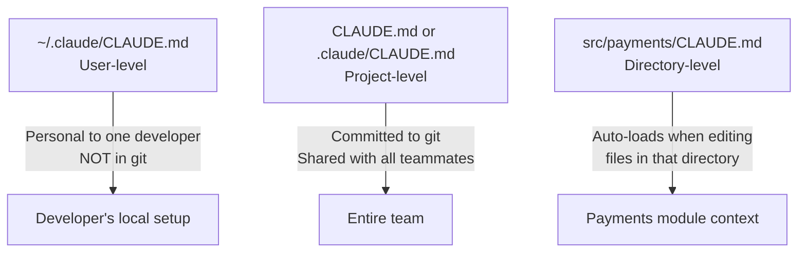

# CLAUDE.md Hierarchy & Modular Structure

← [Domain 3 index](./README.md) · [→ Next: Custom Skills & Commands](./02-custom-skills-and-commands.md)

---

## Core concept

> `CLAUDE.md` is the configuration file that provides Claude Code with persistent context — coding standards, conventions, workflow instructions — that loads automatically at the start of every session. It has a three-level hierarchy (user, project, directory), supports modular @import references, and can be supplemented by path-specific rule files in `.claude/rules/`.

---

## The three-level hierarchy



| Level | Location | Shared? | Auto-loads when |
|-------|----------|---------|----------------|
| User | `~/.claude/CLAUDE.md` | ❌ Personal only | Every Claude Code session for this user |
| Project | `CLAUDE.md` or `.claude/CLAUDE.md` | ✅ Yes (git) | Every Claude Code session in this project |
| Directory | `src/feature/CLAUDE.md` | ✅ Yes (git) | Editing files within that directory |

---

## Modularisation with @import

When CLAUDE.md grows large (400+ lines), don't delete content or split into directory files. Use `@import` to keep the root file concise while referencing detailed guides on demand.

```markdown
# CLAUDE.md (root — stays concise)

## Core principles
- All new code must have unit tests
- PRs require two approvals before merge
- Never commit directly to main

## Standards references
@import ./.claude/standards/typescript.md
@import ./.claude/standards/testing.md
@import ./.claude/standards/api-conventions.md
```

Each imported file loads only when relevant context requires it, not on every session start.

**When to use @import vs directory CLAUDE.md:**
- `@import`: For detailed standards files that supplement the root config
- Directory CLAUDE.md: For module-specific context that should load automatically when working in that directory

---

## .claude/rules/ directory

An alternative to directory CLAUDE.md files. Rule files in `.claude/rules/` use YAML frontmatter to specify which file paths activate them:

```markdown
---
paths:
  - "terraform/**/*"
  - "infrastructure/**/*.tf"
---

# Terraform conventions

- Always use modules for reusable infrastructure
- Tag all resources with environment and owner
- Never hardcode credentials — use variable files
```

This rule file only loads when Claude is editing Terraform files — not for every session.

**Directory CLAUDE.md vs .claude/rules/ — which to use:**

| Situation | Use |
|-----------|-----|
| Conventions apply to all files in one directory | Directory `CLAUDE.md` |
| Conventions apply to files by type, spread across directories | `.claude/rules/` with glob paths |

Example: All `**/*.test.tsx` files across the whole codebase should follow the same testing conventions → `.claude/rules/testing.md` with `paths: ["**/*.test.tsx"]` is better than a directory CLAUDE.md (tests are spread across many directories).

---

## What goes in CLAUDE.md vs what doesn't

| Include in CLAUDE.md | Don't include |
|---------------------|--------------|
| Coding standards and conventions | Secrets, tokens, passwords |
| Project architecture overview | Frequently changing content |
| Testing requirements | Content better suited for a README |
| Workflow steps (PR checklist, deploy process) | Very long exemplar code (use @import) |
| Environment setup instructions | |

---

## ⚠️ Exam traps

| Wrong answer | Correct answer |
|-------------|---------------|
| "Split into separate directory CLAUDE.md files to reduce file size" | Use `@import` — keeps root concise; imports load on demand |
| "Put team-shared instructions in ~/.claude/CLAUDE.md" | ~/.claude/CLAUDE.md is personal/user-level, NOT in git |
| "Use directory CLAUDE.md for test file conventions that span multiple directories" | Use `.claude/rules/` with `paths: ["**/*.test.tsx"]` glob pattern |
| "Delete low-priority sections to trim file size" | `@import` references — preserve detail, reduce active context |

---

## Related topics

- [Custom Skills & Slash Commands](./02-custom-skills-and-commands.md) — skills vs CLAUDE.md (always-on vs on-demand)
- [Path-Specific Rules](./03-path-specific-rules.md) — .claude/rules/ in detail
- [MCP Server Integration](../02-Tool-Design-and-MCP/04-mcp-server-integration.md) — .mcp.json alongside CLAUDE.md
