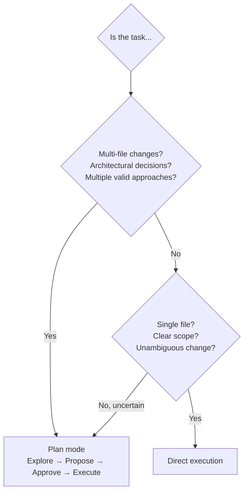

# Plan Mode vs Direct Execution

← [Path-Specific Rules](./03-path-specific-rules.md) · [→ Next: Iterative Refinement](./05-iterative-refinement.md)

---

## Core concept

> **Plan mode** lets Claude explore the codebase and propose a complete plan before making any changes. You review and approve the plan before implementation begins. Use it for complex, multi-file, or architecturally significant tasks where a wrong first step causes expensive rework. For well-scoped, single-file changes, direct execution is faster and just as reliable.

---

## Decision guide



---

## When to use plan mode

| Situation | Why plan mode |
|-----------|--------------|
| Restructuring monolith into microservices | Multiple valid architectures; wrong choice = weeks of rework |
| Library migration affecting 45+ files | Need to understand full impact before starting |
| Choosing between integration approaches with different infrastructure needs | Architectural decision; need full picture |
| Adding a feature to an unfamiliar codebase | Exploration before implementation prevents mistakes |

**Key**: Enable plan mode **at the start** — before any changes are made. Not mid-task after Claude has already begun modifying files.

---

## When to use direct execution

| Situation | Why direct |
|-----------|-----------|
| Single-file bug fix with clear stack trace | Scope is unambiguous |
| Adding one validation check to one function | Small, contained change |
| Renaming a variable | Mechanical, predictable |
| Implementing a feature with clear requirements and no architectural decisions | No exploration needed |

---

## The Explore subagent

The Explore subagent is a specialised Claude Code feature for **discovery phases** of multi-phase tasks. It isolates verbose discovery output from the main conversation.

**Problem without Explore**:
```
Phase 1: Discover all API call locations (verbose output: 3000 tokens of grep results)
Phase 2: Design error handling strategy (needs to reason from Phase 1 findings)
Phase 3: Implement changes

Without Explore: All 3000 tokens of Phase 1 output stay in context,
competing with Phase 2 reasoning and Phase 3 implementation.
```

**With Explore**:
```python
# Phase 1: Use Explore subagent for discovery
explore_result = spawn_explore_subagent(
    "Find all external API calls across the 120-file codebase. 
     Return: list of files, functions, and call patterns. Keep summary concise."
)
# Explore runs in isolation; returns only a structured summary

# Phase 2 & 3: Continue in main conversation with clean context
# Pass only the summary, not the raw discovery output
```

The Explore subagent's verbose output is discarded; only the summary returns to the main session.

---

## Plan mode + direct execution combined

The most powerful pattern: plan mode for investigation, direct execution for implementation.

```
Example: Migrate from library A to library B

1. Enable plan mode
   Claude explores: Where is library A used? What are the migration paths?
   Claude proposes: Full migration plan with file list and order

2. Review and approve the plan
   You: Looks good, but defer the API middleware migration to a separate PR

3. Switch to direct execution
   Claude implements the approved plan (minus the deferred part)
```

---

## ⚠️ Exam traps

| Wrong answer | Correct answer |
|-------------|---------------|
| "Start in normal mode, switch to plan mode once Claude begins making changes" | Enable plan mode **at the start** — before any changes |
| "Use --dry-run to preview changes without plan mode" | --dry-run doesn't exist; plan mode is the mechanism for pre-implementation review |
| "Use plan mode for the design phase and normal mode for implementation in the same session" | Yes — this is actually correct and the intended combined pattern |
| "Use Explore subagent because it has better tools than the main agent" | Explore isolates verbose output; it's about context management, not tool capability |

---

## Related topics

- [Iterative Refinement](./05-iterative-refinement.md) — refining output after initial implementation
- [Session State & Forking](../01-Agentic-Architecture/07-session-state-and-forking.md) — session management during multi-phase tasks
- [Large Codebase Exploration](../05-Context-and-Reliability/04-large-codebase-exploration.md) — managing context during discovery phases
