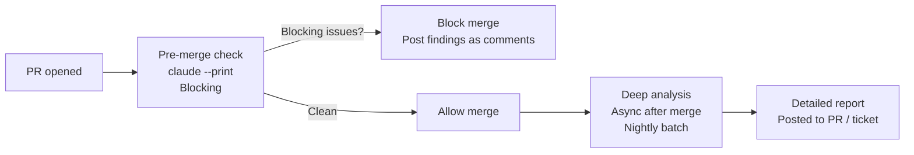

# CI/CD Pipeline Integration

← [Iterative Refinement](./05-iterative-refinement.md) · [→ Domain 4: Prompt Engineering](../04-Prompt-Engineering/README.md)

---

## Core concept

> Claude Code in CI/CD pipelines runs **non-interactively** — no human present to answer questions. Without the right flags, Claude will hang waiting for input and block your pipeline. Additional configuration ensures structured, parseable output and review continuity across commits.

---

## Critical CLI flags

| Flag | Purpose | What happens without it |
|------|---------|------------------------|
| `--print` / `-p` | Non-interactive mode | Claude waits for user input → CI job hangs indefinitely |
| `--output-format json` | JSON-formatted output | Output is human-readable prose → hard to parse programmatically |
| `--json-schema <path>` | Enforce specific JSON schema | Output may have inconsistent structure |
| `--resume <session-name>` | Resume named session | Starts fresh each time → no continuity |

```bash
# Minimal CI invocation
claude --print "Review this PR for security issues. Changed files: $(git diff --name-only HEAD~1)"

# With structured output for posting inline PR comments
claude --print \
       --output-format json \
       --json-schema ./review-schema.json \
       "Review the following changed files..."
```

---

## Pipeline architecture: pre-merge vs async



| Stage | Speed requirement | Use |
|-------|-----------------|-----|
| Pre-merge (blocking) | Fast — developers wait | Focused prompt: security, breaking changes, critical bugs only |
| Post-merge / nightly | No deadline | Comprehensive prompt: style, coverage, architecture, docs |

**Key rule**: The pre-merge check should be scoped to **blocking issues only**. Checking everything (style, architecture, minor improvements) in a blocking check causes 8–12 minute waits that frustrate developers.

---

## Pre-merge prompt design

```
❌ Pre-merge prompt (too comprehensive):
"Review this PR for security vulnerabilities, breaking API changes,
test coverage gaps, code style, documentation, error handling,
performance implications, and adherence to our coding conventions."

✅ Pre-merge prompt (blocking issues only):
"Review the changed files for BLOCKING issues only:
1. Security vulnerabilities (SQL injection, auth bypass, exposed credentials)
2. Breaking API changes that would fail existing consumers
3. Critical bugs that would cause data loss or crashes

Skip style issues, minor improvements, and documentation — these run in the async review.
For each blocking issue found: file, line number, severity, specific problem, suggested fix."
```

---

## Review continuity across commits

When a developer pushes follow-up commits after an initial review, the second review pass should not re-flag already-fixed issues.

```bash
# First review: find and post 12 findings
claude --print "Review these files: [file list]" > findings_v1.json

# Developer fixes issues, pushes new commit

# Second review: include prior findings as context
claude --print \
  "Review these files: [file list]

Prior review findings (from previous run):
$(cat findings_v1.json)

Report ONLY:
1. New issues not in the prior findings
2. Prior findings that are still unaddressed

Do NOT re-report already-fixed issues." > findings_v2.json
```

Without this context, the second review re-flags everything, generating duplicate comments and frustrating the developer.

---

## Avoiding duplicate test suggestions

When generating test cases, include the existing test file:

```bash
claude --print \
  "Generate additional test cases for src/payments/refund.py.

Existing tests (do NOT suggest duplicates):
$(cat tests/test_refund.py)

Suggest only test scenarios not already covered."
```

---

## Structured output for inline PR comments

```json
// review-schema.json
{
  "type": "array",
  "items": {
    "type": "object",
    "required": ["file", "line", "severity", "issue", "suggestion"],
    "properties": {
      "file": {"type": "string"},
      "line": {"type": "integer"},
      "severity": {"type": "string", "enum": ["critical", "high", "medium", "low"]},
      "issue": {"type": "string"},
      "suggestion": {"type": "string"}
    }
  }
}
```

Parse the JSON output → post each finding as an inline comment at the correct file + line via the GitHub API.

---

## Independent review instance for self-review

A model reviewing its own code has reasoning context from generation — it already "knows" why it made each decision, making it less likely to question them.

```
❌ Same Claude instance reviews its own generated code
   → Self-review bias; subtle issues missed

✅ Fresh Claude instance with no prior context reviews the code
   → Independent perspective catches issues the generator overlooked
```

In practice: generate code in one Claude call → review it in a separate Claude call with no connection to the generation session.

---

## ⚠️ Exam traps

| Wrong answer | Correct answer |
|-------------|---------------|
| "Switch pre-merge hook to Haiku to reduce review time" | **Narrow the prompt scope** — focus on blocking issues only |
| "Add 'provide actionable feedback' to review prompt" | Add **structured output format**: file, line, issue, suggested fix |
| "Add keyword filter post-processing to deduplicate test suggestions" | Include **existing test file in context** so Claude doesn't suggest duplicates |
| "Run the second review without context from the first" | Pass prior findings; instruct Claude to only report new/unresolved issues |
| "Use the same Claude session that generated the code to review it" | Use an **independent Claude instance** for code review |

---

## Related topics

- [Prompt Engineering: Explicit Criteria](../04-Prompt-Engineering/01-explicit-criteria.md) — reducing false positives in automated reviews
- [Structured Output & JSON Schemas](../04-Prompt-Engineering/03-structured-output-json-schemas.md) — schema enforcement for CI output
- [Multi-Pass Review](../04-Prompt-Engineering/06-multi-pass-review.md) — splitting large reviews into multiple focused passes
