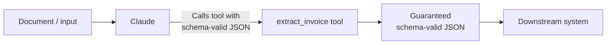

# Structured Output & JSON Schemas

← [Few-Shot Prompting](./02-few-shot-prompting.md) · [→ Next: Validation & Retry Loops](./04-validation-and-retry-loops.md)

---

## Core concept

> The most reliable way to get guaranteed schema-compliant structured output from Claude is through the **tool_use mechanism** combined with a JSON schema. When you define an extraction "tool" with a JSON schema as its input parameters, Claude is forced to call that tool with schema-valid arguments — eliminating JSON syntax errors entirely. Asking Claude to "respond in JSON" gives you JSON most of the time, but not guaranteed.

---

## The tool_use approach for structured extraction



**How it works**: You define a tool whose "input schema" is actually your desired output format. Claude "calls" the tool by generating the JSON that conforms to the schema. You extract the result from the tool call arguments.

```python
tools = [
    {
        "name": "extract_invoice",
        "description": "Extract structured data from an invoice document",
        "input_schema": {
            "type": "object",
            "required": ["vendor_name", "invoice_date", "line_items", "total"],
            "properties": {
                "vendor_name": {"type": "string"},
                "invoice_date": {
                    "type": ["string", "null"],
                    "description": "ISO 8601 date. Null if not found."
                },
                "line_items": {
                    "type": "array",
                    "items": {
                        "type": "object",
                        "properties": {
                            "description": {"type": "string"},
                            "quantity": {"type": "number"},
                            "unit_price": {"type": "number"}
                        }
                    }
                },
                "total": {"type": ["number", "null"]},
                "currency": {
                    "type": "string",
                    "enum": ["USD", "EUR", "GBP", "other"],
                    "description": "Use 'other' for currencies not listed"
                }
            }
        }
    }
]

response = client.messages.create(
    model="claude-sonnet-4-6",
    tools=tools,
    tool_choice={"type": "tool", "name": "extract_invoice"},
    messages=[{"role": "user", "content": invoice_text}]
)

# Extract the structured data from the tool call
extracted = response.content[0].input  # Guaranteed to match the schema
```

---

## tool_choice options for extraction

| tool_choice | Behaviour | Use when |
|------------|-----------|---------|
| `{"type": "auto"}` | Claude may call a tool OR return text | Most conversational uses |
| `{"type": "any"}` | Must call a tool; Claude chooses which | Multiple extraction schemas; document type unknown |
| `{"type": "tool", "name": "..."}` | Must call this specific tool | Single extraction schema; force a prerequisite step |

**Example — "any" for multi-schema extraction**:
```python
tools = [extract_invoice, extract_receipt, extract_contract]
tool_choice = {"type": "any"}
# Claude picks the right schema based on the document type
```

---

## Schema design principles

### Make fields nullable for absent information
```json
// ❌ Required field Claude can't always find → fabrication
"invoice_number": {"type": "string"}  // What if it's not present?

// ✅ Nullable field → Claude returns null instead of fabricating
"invoice_number": {"type": ["string", "null"], "description": "Null if not found in document"}
```

### Use enums with "other" + detail for extensible categories
```json
"payment_method": {
  "type": "string",
  "enum": ["credit_card", "bank_transfer", "check", "other"]
},
"payment_method_detail": {
  "type": ["string", "null"],
  "description": "Required when payment_method is 'other'"
}
```

### Add "unclear" for ambiguous cases
```json
"approval_status": {
  "type": "string",
  "enum": ["approved", "pending", "rejected", "unclear"],
  "description": "Use 'unclear' when the document is ambiguous"
}
```

---

## What JSON schema guarantees — and what it doesn't

| ✅ Schema eliminates | ❌ Schema does NOT prevent |
|---------------------|--------------------------|
| JSON syntax errors | Semantic errors (line items don't sum to total) |
| Missing required fields | Values placed in wrong fields |
| Wrong data types | Plausible-but-incorrect values for absent information |
| Invalid enum values | Contradictory data within the schema |

For semantic validation, use a **self-correction validation flow**: extract `calculated_total` and `stated_total` as separate fields, add `total_matches` boolean. The extraction itself flags the discrepancy.

---

## ⚠️ Exam traps

| Wrong answer | Correct answer |
|-------------|---------------|
| "Ask Claude to respond in JSON format" | Use tool_use with JSON schema — eliminates syntax errors |
| "Use tool_choice: auto to guarantee tool use" | `auto` allows text response; use `"any"` or forced tool |
| "Make all fields required to get complete extractions" | Make fields nullable for information that may be absent — prevents fabrication |
| "JSON schema prevents all extraction errors" | Schema prevents syntax errors; semantic validation needs additional self-correction logic |

---

## Related topics

- [Tool Distribution & tool_choice](../02-Tool-Design-and-MCP/03-tool-distribution-and-choice.md) — tool_choice in the full context of tool configuration
- [Validation & Retry Loops](./04-validation-and-retry-loops.md) — what to do when extraction fails validation
- [Few-Shot Prompting](./02-few-shot-prompting.md) — examples that complement schema enforcement
