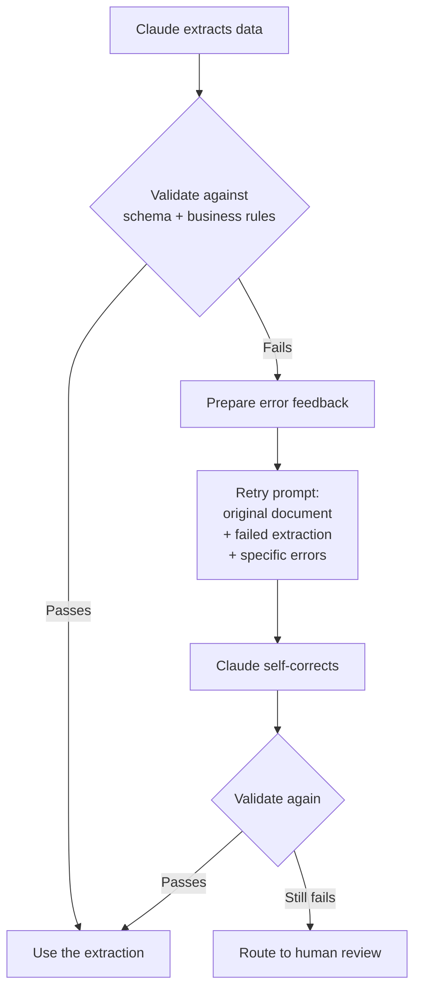

# Validation & Retry Loops

← [Structured Output & JSON Schemas](./03-structured-output-json-schemas.md) · [→ Next: Batch Processing](./05-batch-processing.md)

---

## Core concept

> When an extraction or generation fails validation, the most effective recovery is a **retry that includes the specific validation errors** in the follow-up prompt. This lets Claude self-correct based on explicit feedback. However, retries only work when the required information exists in the provided document — retrying a request for information that was never there will always fail.

---

## Retry with error feedback



---

## What to include in a retry prompt

```python
retry_prompt = f"""
The previous extraction of this invoice contained errors. Please re-extract,
correcting the following specific issues:

Original document:
{original_document}

Previous extraction (with errors):
{failed_extraction}

Validation errors found:
1. line_items total (${line_items_sum:.2f}) does not match stated total (${stated_total:.2f})
2. invoice_date format invalid: got '01-15-2024', expected ISO 8601 (YYYY-MM-DD)
3. currency field contains 'Dollars' — must be one of: USD, EUR, GBP, other

Please re-extract with these corrections applied.
"""
```

The retry includes:
1. The original document (so Claude can re-read it)
2. The failed extraction (so Claude knows what it tried)
3. The **specific** errors (so Claude knows exactly what to fix)

---

## When retries will and won't work

| Situation | Will retry work? | Reason |
|-----------|-----------------|--------|
| Wrong date format (2024-01-15 vs 01-15-2024) | ✅ Yes | The information exists; format error only |
| Total doesn't match sum of line items | ✅ Yes | Arithmetic error Claude can self-correct |
| Required field absent because not in document | ❌ No | The information doesn't exist to extract |
| Field present in an external document not provided | ❌ No | Claude cannot access information not in its context |
| Model returned "unclear" for an ambiguous field | ❌ No | If the document is genuinely ambiguous, Claude can't resolve it |

**Rule**: Retry when the information is present but was extracted incorrectly. Don't retry when the information simply doesn't exist in the provided document — route to human review instead.

---

## Self-correction validation design

Design extraction schemas to flag discrepancies within the extraction itself:

```json
{
  "stated_total": 1247.50,
  "calculated_total": 1180.00,
  "total_matches": false,
  "discrepancy_note": "Calculated sum of line items ($1,180.00) differs from stated total ($1,247.50) by $67.50"
}
```

This surfaces the discrepancy without needing a separate validation step. Claude flags it within the extraction, and your code routes `total_matches: false` extractions to human review or a retry.

---

## Tracking patterns for systematic improvement

Add a `detected_pattern` field to review findings to enable later analysis of false positives:

```json
{
  "file": "src/payments/refund.py",
  "line": 47,
  "severity": "medium",
  "issue": "Missing null check on customer_id",
  "detected_pattern": "null_check_missing_before_api_call"
}
```

When developers dismiss findings, aggregate by `detected_pattern`. If `null_check_missing_before_api_call` has a 60% dismissal rate, the prompt for that check type needs refinement — or the threshold for flagging it needs raising.

---

## ⚠️ Exam traps

| Wrong answer | Correct answer |
|-------------|---------------|
| "Retry with the same prompt when validation fails" | Include **specific errors** in the retry — same prompt produces same error |
| "Retry when the required field is missing because it's not in the document" | Route to human review — retrying can't extract non-existent information |
| "Validate using schema only — JSON schema catches all errors" | Schema catches syntax errors; add business logic validation (totals match, dates valid) |
| "Use a separate Claude call to expand/correct each finding" | Add self-correction within the extraction schema itself (calculated vs stated total) |

---

## Related topics

- [Structured Output & JSON Schemas](./03-structured-output-json-schemas.md) — schema design that prevents common errors
- [Human Review & Confidence Calibration](../05-Context-and-Reliability/05-human-review-and-confidence.md) — routing low-confidence extractions to human review
- [Error Propagation](../05-Context-and-Reliability/03-error-propagation.md) — structured error patterns across the system
