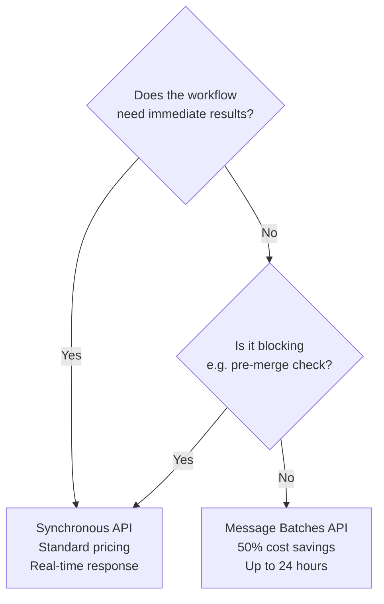

# Batch Processing

← [Validation & Retry Loops](./04-validation-and-retry-loops.md) · [→ Next: Multi-Pass Review](./06-multi-pass-review.md)

---

## Core concept

> The **Message Batches API** processes large volumes of requests asynchronously at **50% cost savings**, with results available within 24 hours. It's designed for workloads that don't need immediate responses — nightly analysis, weekly audits, bulk extraction. It cannot be used for blocking workflows or any task that requires real-time tool execution.

---

## Batch API at a glance

| Feature | Value |
|---------|-------|
| Cost savings | **50% off** standard API pricing |
| Processing time | Up to **24 hours** (no latency SLA) |
| Multi-turn tool calling | ❌ Not supported |
| Blocking workflows | ❌ Not appropriate |
| Max requests per batch | 10,000 |
| Request correlation | `custom_id` field |

---

## When to use batch vs synchronous API



| Workflow | API | Why |
|----------|-----|-----|
| Pre-merge code review (blocks developer) | Synchronous | Must return before developer can merge |
| Nightly comprehensive code analysis | Batch | No one waiting; results needed by morning |
| Weekly documentation audit | Batch | Latency-tolerant |
| Async test case generation after merge | Batch | Not blocking any workflow |
| Customer support agent (real-time) | Synchronous | Customer is waiting |
| Bulk invoice extraction (overnight) | Batch | 50% savings; results needed by morning |

---

## No multi-turn tool calling in batch

This is a critical constraint. The batch API processes each request as a single turn — you cannot execute tools mid-request and feed results back.

```
❌ Cannot do in batch:
   Request → Claude calls search_web → You execute search → Return results → Claude continues
   (This requires a multi-turn tool execution loop)

✅ Can do in batch:
   Provide all context upfront in the request
   Claude generates a response based on that context
   No tool calls needed mid-request
```

**Implication**: Tasks requiring tool calls (web search, database lookups) must use the synchronous API. Batch is for analysis, extraction, and generation from provided context.

---

## custom_id for request correlation

When submitting thousands of documents, `custom_id` lets you match responses to requests:

```python
batch_requests = []
for doc_id, document in documents.items():
    batch_requests.append({
        "custom_id": f"invoice_{doc_id}",  # Your identifier
        "params": {
            "model": "claude-haiku-4-5-20251001",
            "messages": [{"role": "user", "content": document}],
            "tools": [extract_invoice_tool],
            "tool_choice": {"type": "tool", "name": "extract_invoice"}
        }
    })

# Submit batch
batch = client.beta.messages.batches.create(requests=batch_requests)

# When results arrive:
for result in client.beta.messages.batches.results(batch.id):
    doc_id = result.custom_id.replace("invoice_", "")
    if result.result.type == "succeeded":
        extracted_data[doc_id] = result.result.message.content[0].input
    elif result.result.type == "errored":
        failed_docs.append(doc_id)
```

---

## SLA calculation

If your SLA requires results within 30 hours:
- Batch processing can take up to 24 hours
- Submit batches every 4 hours (`30 - 24 = 6` hours buffer, use 4 to be safe)
- With 4-hour submission frequency, worst case: batch submitted just after window → results 28 hours later

---

## Handling batch failures

Not all requests in a batch succeed. Common failures:
- **Exceeded context limit**: Document too long → chunk and resubmit
- **Model error**: Rare; resubmit as-is
- **Schema validation failure**: Fix the document or prompt; resubmit

Only resubmit failed requests (identified by `custom_id`) — not the entire batch.

---

## ⚠️ Exam traps

| Wrong answer | Correct answer |
|-------------|---------------|
| "Use batch API for pre-merge checks to save cost" | Pre-merge checks are blocking — must use synchronous API |
| "Batch API supports tool calling within requests" | No multi-turn tool calling in batch — provide all context upfront |
| "Batch processes immediately at lower priority" | No latency SLA — can take up to 24 hours |
| "Resubmit the entire batch when some requests fail" | Resubmit only failed requests using their `custom_id` |

---

## Related topics

- [CI/CD Integration](../03-Claude-Code-Configuration/06-cicd-integration.md) — synchronous API for blocking CI checks
- [Model Selection](../00-Foundations/04-model-selection.md) — Haiku is often the right tier for batch workloads
- [Structured Output & JSON Schemas](./03-structured-output-json-schemas.md) — combine with tool_use for schema-valid batch extraction
