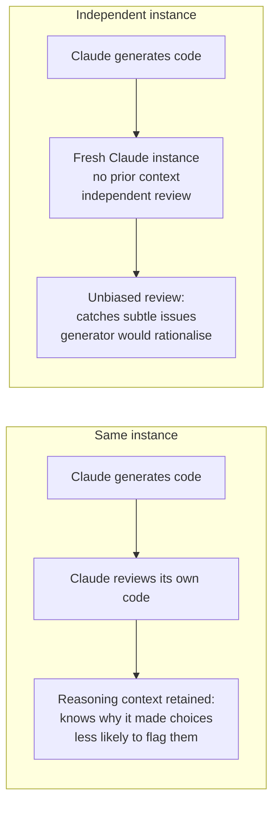
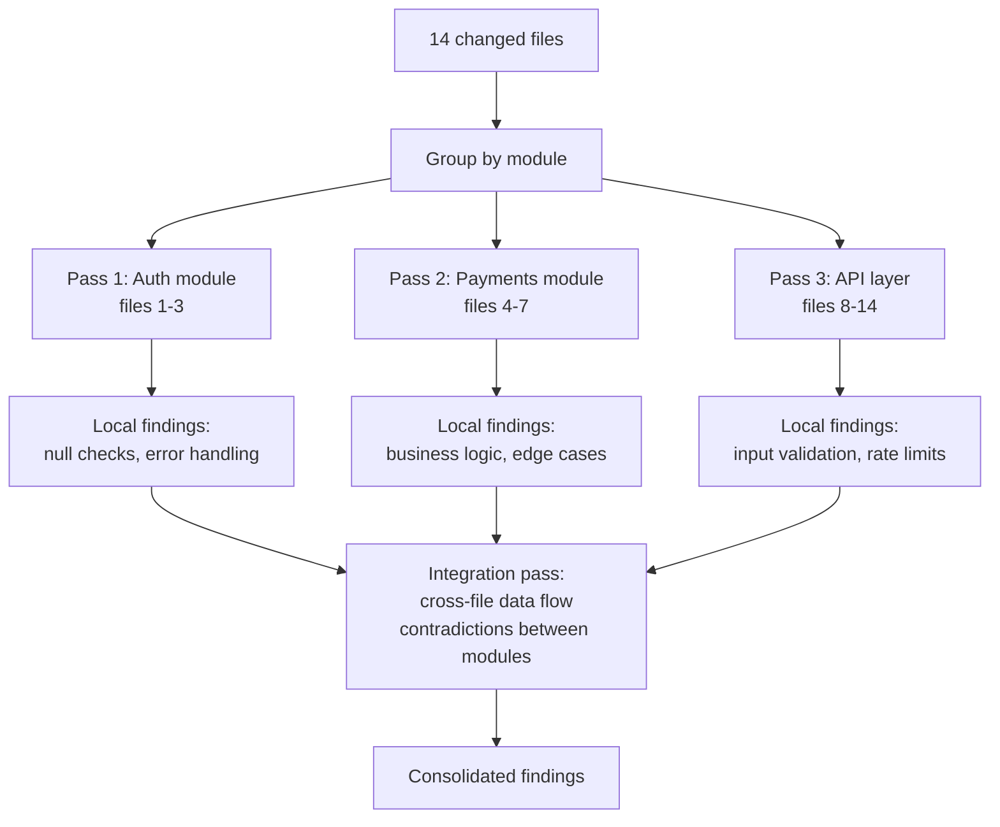

# Multi-Pass & Multi-Instance Review

← [Batch Processing](./05-batch-processing.md) · [→ Domain 5: Context & Reliability](../05-Context-and-Reliability/README.md)

---

## Core concept

> A model reviewing its own output is less effective than an independent review because it retains the **reasoning context** from generation — it already "knows" why it made each decision and is less likely to question them. For critical quality checks, use a **second independent Claude instance**. For large multi-file reviews, split into **multiple focused passes** to avoid attention dilution.

---

## Self-review limitations



**When self-review is "good enough"**: Style checks, formatting, obvious bugs.
**When independent review matters**: Security audits, architectural decisions, correctness of complex logic.

---

## Multi-pass review architecture

For large PRs with many files:



**Why split?**
- **Attention dilution**: Reviewing 14 files in one prompt spreads Claude's attention thin. Files in the middle get less thorough review.
- **Contradictory findings**: A local analysis pass may flag an issue in File A that's actually resolved in File B. The integration pass reconciles these.
- **Manageable context**: Each pass has a smaller, focused context → more reliable results.

---

## Confidence alongside findings

Add a self-reported confidence score to each finding to enable calibrated routing:

```json
{
  "file": "src/payments/refund.py",
  "line": 47,
  "issue": "Missing null check",
  "severity": "high",
  "confidence": 0.95,
  "reasoning": "customer_id is passed directly to lookup_order without null guard"
}

{
  "file": "src/api/endpoints.py",
  "line": 203,
  "issue": "Potential race condition in session handling",
  "severity": "high",
  "confidence": 0.60,
  "reasoning": "Only a race condition if concurrent requests arrive within the same 50ms window — depends on traffic volume"
}
```

Findings above confidence threshold → post automatically.
Below threshold → route to human reviewer.

---

## Review instance strategy summary

| Scenario | Instance strategy |
|----------|-----------------|
| Developer wants review of their own code | Independent instance (most effective) |
| CI auto-review on every PR | Independent instance per PR (new session each time) |
| Agent reviewing its own generated output | Independent instance — separate call, no shared context |
| Large multi-file PR | Multi-pass: per-module local passes + integration pass |
| High-volume reviews with cost constraint | Batch API with independent instances |

---

## ⚠️ Exam traps

| Wrong answer | Correct answer |
|-------------|---------------|
| "Add 'review your output carefully' instruction to the same generation call" | Use an **independent Claude instance** with no generation context |
| "Review all files in a single pass with thorough instructions" | **Multi-pass by module** + integration pass; attention dilution is real |
| "Self-review is equivalent to independent review for security checks" | Self-review has bias; use independent instance for security-critical checks |
| "Run verification pass after each file" | Group into logical modules for local passes; cross-file integration is a separate pass |

---

## Related topics

- [CI/CD Integration](../03-Claude-Code-Configuration/06-cicd-integration.md) — independent instances in CI pipeline design
- [Task Decomposition](../01-Agentic-Architecture/06-task-decomposition.md) — multi-pass = sequential decomposition applied to review
- [Explicit Criteria](./01-explicit-criteria.md) — criteria to apply in each review pass
