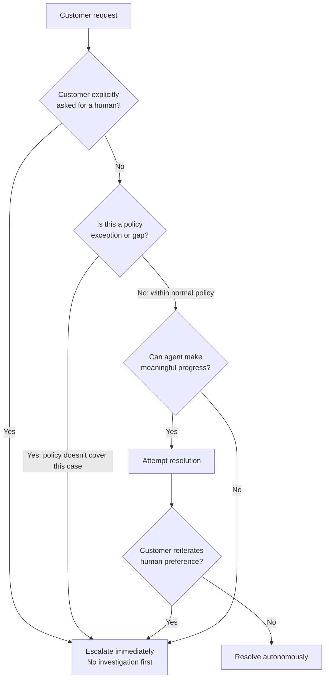

# Escalation & Ambiguity Resolution

← [Context Management](./01-context-management.md) · [→ Next: Error Propagation](./03-error-propagation.md)

---

## Core concept

> Effective escalation calibration means knowing when to escalate vs resolve autonomously. The two common failure modes are: escalating too readily (low first-contact resolution, frustrating customers with capable agents), and failing to escalate when genuinely needed (attempting to handle cases the agent shouldn't). Escalation triggers must be explicit and categorical — not based on sentiment or self-reported confidence scores.

---

## The escalation decision



---

## Escalation triggers — explicit categories

```
ESCALATE WHEN:
1. Customer explicitly asks for a human agent
   → Even if the issue is simple. Honour the request immediately.
   → Exception: can briefly acknowledge and offer resolution ONCE if clearly resolvable,
     but escalate immediately if customer reiterates.

2. Policy exception or gap
   → The customer's request falls outside what policy explicitly covers
   → E.g., competitor price matching when policy only addresses own-site price adjustments
   → Do NOT make up policy on the fly

3. Unable to make meaningful progress
   → Multiple tool attempts have failed to resolve the issue
   → Required information is unavailable
   → Case complexity exceeds autonomous resolution capability

4. Ambiguous customer identity
   → lookup_customer returns multiple matches
   → Request additional identifiers; do not guess
```

---

## What NOT to use as escalation triggers

| ❌ Unreliable trigger | Why it fails |
|--------------------|-------------|
| Sentiment analysis (frustration detected) | Customers can be frustrated about simple resolvable issues |
| Self-reported confidence score (< 7/10) | Agents are poorly calibrated; confidence ≠ actual complexity |
| "Complex case" classification | Many complex-seeming cases are standard returns/refunds |
| Number of turns in conversation | Length ≠ complexity |

---

## Handling explicit human requests

```
Customer: "I want to talk to a human."

❌ Wrong:
"I understand your frustration. Before I connect you, let me try to resolve this quickly..."
[Investigates issue]
[Customer: "I said I want a human!"]

✅ Correct (standard resolution offered once):
"I understand. I can see you'd like to speak with someone directly. If it would be quicker,
I can see your order is eligible for an immediate refund — would you like me to process
that now, or would you prefer I connect you to our team?"

→ If customer reiterates human preference → escalate immediately, no more attempts
→ If customer says yes to resolution → proceed
```

---

## Handling policy gaps

When a customer requests something the policy doesn't explicitly address:

```
Customer: "I saw the same product at CompetitorX for $30 less — can you match it?"
Policy: Only covers our own website price adjustments, not competitor pricing.

❌ Wrong: "I'm sorry, we can only price match our own website."
   (Makes up a denial that's not in the policy either)

❌ Wrong: "Let me apply the competitor discount for you."
   (Makes up approval that's not in the policy)

✅ Correct:
Escalate to human with structured handoff:
"Customer is requesting competitor price match on Product X.
Current policy covers own-site adjustments only.
Competitor price: $89.99 (our price: $119.99, difference: $30).
Customer account: Gold tier, 3-year customer, $2,400 LTV.
Recommended action: Manager discretion on price match approval."
```

---

## Multiple customer matches

When `get_customer` returns multiple matches for the provided identifier:

```
❌ Wrong: Select the most recently active customer account (heuristic)
❌ Wrong: Try all matches and see which has matching order data

✅ Correct:
Ask for additional identifying information:
"I found a few accounts associated with that email. Could you provide
your order number or the last four digits of your payment method to
confirm which account you're referring to?"
```

---

## ⚠️ Exam traps

| Wrong answer | Correct answer |
|-------------|---------------|
| "Implement sentiment analysis to detect when to escalate" | Explicit categorical triggers (human request, policy gap, no progress) |
| "Have agent report confidence score and escalate below 7/10" | Confidence scores are poorly calibrated; use categorical triggers |
| "Investigate first, then escalate if customer repeats human request" | Honour human request immediately; offer resolution once, not multiple times |
| "Select most recent account when multiple matches found" | Ask for additional identifying information |
| "Escalate whenever the case seems complex" | Resolve standard policy cases autonomously; escalate policy exceptions |

---

## Related topics

- [Multi-Step Workflows](../01-Agentic-Architecture/04-multi-step-workflows.md) — structured handoff protocols when escalating
- [Context Management](./01-context-management.md) — case facts block ensures handoff has complete information
- [Human Review & Confidence](./05-human-review-and-confidence.md) — calibrating confidence for routing decisions
