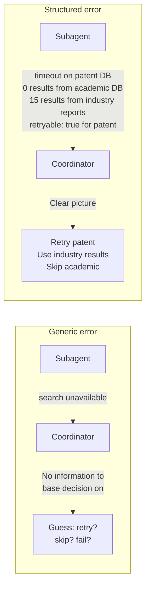
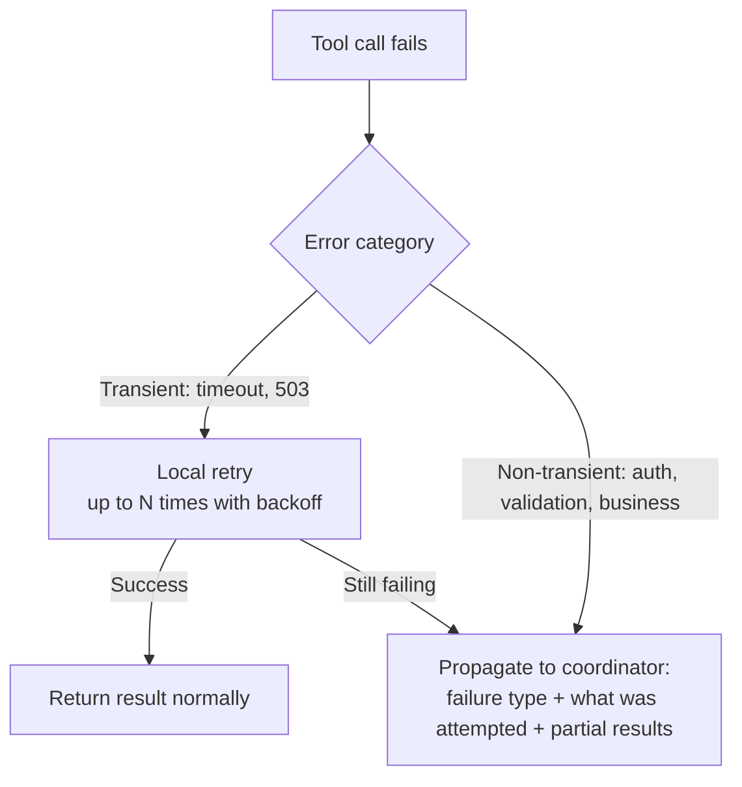

# Error Propagation Across Multi-Agent Systems

← [Escalation Patterns](./02-escalation-patterns.md) · [→ Next: Large Codebase Exploration](./04-large-codebase-exploration.md)

---

## Core concept

> In multi-agent systems, how errors propagate from subagents to the coordinator determines whether the coordinator can make intelligent recovery decisions. Generic error messages ("search failed") are useless for recovery. Structured error context — failure type, what was attempted, partial results, whether retry is appropriate — enables the coordinator to decide the right next action without guessing.

---

## What structured error propagation enables



---

## What to include in a structured error response

```json
{
  "isError": true,
  "errorCategory": "partial_failure",
  "sources": {
    "academic_databases": {
      "status": "success",
      "result": "0 results",
      "isError": false,
      "note": "Valid empty result — no academic papers found for this query"
    },
    "industry_reports": {
      "status": "success",
      "resultsCount": 15,
      "results": [...]
    },
    "patent_databases": {
      "status": "failed",
      "isError": true,
      "errorCategory": "transient",
      "isRetryable": true,
      "failureType": "connection_timeout",
      "whatWasAttempted": "Searched USPTO and EPO for AI creative industries patents 2020-2026",
      "suggestedRetryDelay": "30s"
    }
  }
}
```

---

## The critical distinction: access failure vs empty result

This distinction appears directly on the exam:

| Situation | Classification | Coordinator action |
|-----------|---------------|-------------------|
| `"Connection timeout"` | Access failure (transient error) | Retry decision |
| `"0 results found"` | Successful query, no matching data | Use other results; don't retry |
| `"401 Unauthorized"` | Access failure (permission error) | Escalate; no retry |
| `"Invalid query syntax"` | Access failure (validation error) | Fix query; no retry |

**Reporting both as failures** wastes the coordinator's retry budget on a query that succeeded — it simply found nothing.

---

## Subagent local recovery strategy



**Subagents handle locally**: Transient failures (timeouts, temporary unavailability) — they retry and only escalate if they genuinely can't resolve it.

**Subagents escalate immediately**: Permission errors, business rule violations, validation errors — these won't be fixed by retrying.

---

## Anti-patterns

```
❌ Silent suppression:
   Tool fails → Subagent returns empty results as if successful
   → Coordinator thinks search returned nothing; makes decisions on wrong premise

❌ Immediate full task termination:
   Single subagent failure → Entire research task fails
   → Wastes all successful subagent work; coordinator should recover gracefully

❌ Generic status:
   "search unavailable" for both timeout AND policy violation
   → Coordinator can't distinguish retryable from non-retryable; guesses wrong
```

---

## Synthesis with coverage annotations

When some sources failed, the synthesis should annotate its output with coverage gaps:

```json
{
  "synthesis": "Based on industry reports and news sources...",
  "coverage": {
    "academic_sources": "No results — academic coverage gap in this synthesis",
    "patent_data": "Unavailable due to connection failure — patent landscape not covered",
    "industry_reports": "15 sources — well-covered"
  },
  "confidence": "Medium — covers industry perspective but lacks academic and patent context"
}
```

---

## ⚠️ Exam traps

| Wrong answer | Correct answer |
|-------------|---------------|
| "Report '0 results found' and 'Connection timeout' both as failures" | Distinguish: 0 results = successful query; timeout = access failure |
| "Subagent should always retry before propagating any error" | Only retry transient failures; propagate non-transient immediately |
| "Return a simple error flag when the subagent fails" | Return structured context: error type, retryable flag, what was attempted, partial results |
| "If one subagent fails, fail the entire task" | Coordinator makes recovery decision; use partial results from other subagents |

---

## Related topics

- [Structured Error Responses](../02-Tool-Design-and-MCP/02-structured-error-responses.md) — tool-level error design (complements this)
- [Multi-Agent Coordinator](../01-Agentic-Architecture/02-multi-agent-coordinator.md) — coordinator's role in acting on error information
- [Validation & Retry Loops](../04-Prompt-Engineering/04-validation-and-retry-loops.md) — when retries are appropriate
