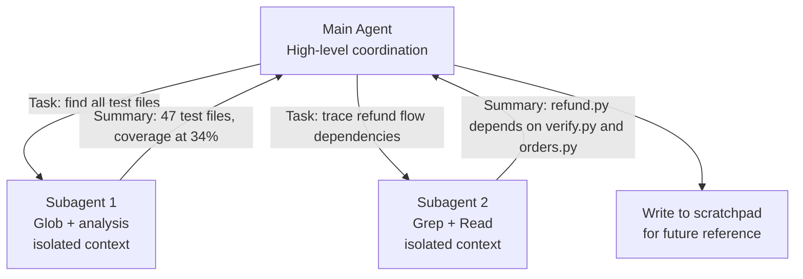

# Large Codebase Exploration

← [Error Propagation](./03-error-propagation.md) · [→ Next: Human Review & Confidence](./05-human-review-and-confidence.md)

---

## Core concept

> Extended exploration sessions suffer from **context degradation** — as the context fills with verbose tool outputs and intermediate findings, the model's answers become less specific and reliable. The fix is active context management: scratchpad files for key findings, subagents for isolated subtasks, /compact for verbose context, and structured state export for crash recovery.

---

## Signs of context degradation

The session has gone on too long or accumulated too much noise when Claude:
- References "typical patterns" instead of specific code it found earlier
- Gives inconsistent answers to the same question asked twice
- Re-explores files it already analysed
- Produces less specific findings over time

---

## Scratchpad files for persistence

Instead of keeping all findings in context, write them to disk:

```python
# Agent writes findings after each major step
write_file("exploration_state.md", """
# Codebase Exploration State

## Modules analysed
- auth/ — MFA implementation, JWT tokens, session management
- payments/ — Stripe integration, refund logic, webhook handling
- notifications/ — Email queue, push notifications, missing retry logic

## Key findings
- auth/verify.py:47 — potential MFA bypass via direct API call
- payments/refund.py:203 — refund amounts not validated against original order
- notifications/queue.py — no dead letter queue; failed emails lost silently

## Dependencies identified
- auth depends on: users table, sessions table
- payments depends on: orders table, customers table
- notifications depends on: all three above

## Next steps
- Explore: orders/ module (not yet analysed)
- Trace: how payments/refund.py calls auth/verify.py
""")
```

For subsequent questions, reference the scratchpad:
```
"According to my exploration notes, the auth module..."
```

---

## Subagents for isolated subtasks

Delegate specific investigation tasks to subagents to prevent their verbose output from bloating the main session:



Subagents do the verbose work; main agent receives only a structured summary.

---

## /compact for context reduction

Use `/compact` when the context fills with verbose discovery output mid-session:

```
/compact

→ Claude summarises earlier context into a compact form
→ Key findings retained; verbose tool results compressed
→ Session can continue with reduced context usage
```

**When to use**: Context is filling up but you want to continue the same session (not start fresh).

**Trade-off**: /compact compresses information. If the compression loses critical details (specific line numbers, exact error messages), starting fresh with an injected summary of key findings may be more reliable.

---

## Crash recovery with state manifests

For long-running multi-agent exploration that must survive interruption:

```json
// exploration_manifest.json
{
  "task": "Full security audit of payments service",
  "started": "2026-05-31T09:00:00Z",
  "modules_completed": ["auth/", "users/"],
  "modules_in_progress": ["payments/"],
  "modules_pending": ["notifications/", "api/"],
  "key_findings_file": "exploration_state.md",
  "critical_findings": [
    {"file": "auth/verify.py", "line": 47, "severity": "critical", "summary": "MFA bypass"}
  ]
}
```

On coordinator restart:
```python
# Load manifest
state = load_json("exploration_manifest.json")
findings = load_file(state["key_findings_file"])

# Inject into new coordinator prompt
prompt = f"""
Continuing security audit. Previous progress:
- Completed: {state['modules_completed']}
- In progress: {state['modules_in_progress']} (interrupted — re-start from beginning of this module)
- Pending: {state['modules_pending']}
- Critical findings so far: {state['critical_findings']}
"""
```

---

## ⚠️ Exam traps

| Wrong answer | Correct answer |
|-------------|---------------|
| "Continue in the same session through the entire exploration" | Use scratchpad files; subagents for verbose subtasks; /compact; or start fresh |
| "Use /compact for everything — no need for scratchpad files" | /compact compresses; scratchpad persists across sessions and session restarts |
| "Spawn subagents for every question to reduce context" | Spawn for large, verbose subtasks; small questions are fine in main session |
| "Context degradation is inevitable — just accept less reliable answers" | Active context management prevents degradation |

---

## Related topics

- [Session State & Forking](../01-Agentic-Architecture/07-session-state-and-forking.md) — session resumption and fresh start decisions
- [Built-in Tools](../02-Tool-Design-and-MCP/05-builtin-tools.md) — Grep, Glob, Read for efficient exploration
- [Tokens & Context Window](../00-Foundations/01-tokens-and-context-window.md) — why context management is necessary
