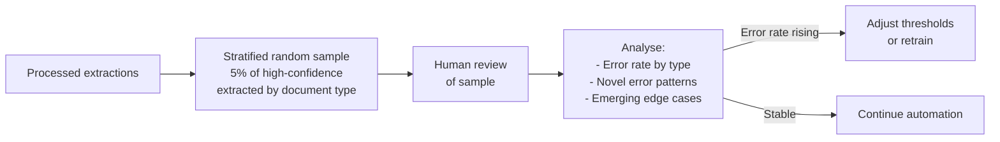
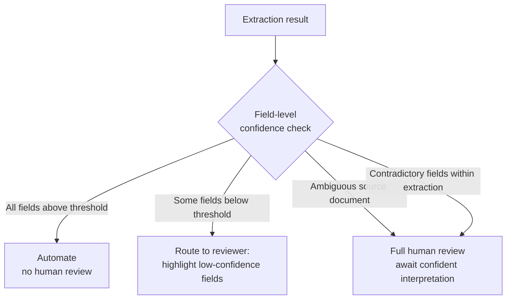

# Human Review & Confidence Calibration

← [Large Codebase Exploration](./04-large-codebase-exploration.md) · [→ Next: Information Provenance](./06-information-provenance.md)

---

## Core concept

> Aggregate accuracy metrics can be misleading. A system reporting 97% overall accuracy may perform poorly on specific document types or fields. Reliable quality assurance requires **stratified sampling** (measuring accuracy by segment, not overall), **field-level confidence scores** calibrated against labeled data, and routing low-confidence extractions to human reviewers before automating them.

---

## The aggregate accuracy trap

```
Example: Invoice extraction system reports 97% accuracy overall

Breakdown:
  Standard US invoices: 99.5% accuracy ← most common type, inflates overall
  Multi-currency EU invoices: 82% accuracy
  Handwritten purchase orders: 61% accuracy
  Invoices with amended totals: 74% accuracy

97% overall → misleads you into automating too early
Segment-level analysis → reveals 3 problem categories before automation
```

**Rule**: Before reducing human review or automating any category, validate accuracy **by document type and field segment** — not just overall.

---

## Stratified sampling for ongoing monitoring

After automating high-confidence extractions, don't assume they stay accurate. Novel document formats and edge cases emerge continuously.



**Why stratified, not random**: Simple random sampling under-samples rare document types. If handwritten POs are 2% of volume but have 61% error rate, a random sample may include only 1-2 of them.

---

## Field-level confidence scores

Overall confidence isn't useful for routing — a high-confidence extraction may have one unreliable field that needs human review while the rest are solid.

```json
{
  "extracted_data": {
    "vendor_name": "Acme Corp",
    "invoice_date": "2026-05-15",
    "line_items": [...],
    "total": 1247.50,
    "currency": "USD"
  },
  "confidence": {
    "vendor_name": 0.99,
    "invoice_date": 0.95,
    "line_items": 0.88,
    "total": 0.72,
    "currency": 0.99
  }
}
```

Field-level routing:
- `total confidence 0.72` → flag for human review of total only
- Other fields at 0.95+ → automate

---

## Calibration against labeled validation sets

Confidence scores from models are often poorly calibrated out of the box — a model might say 0.80 confidence when the actual accuracy at that threshold is only 0.65.

**Calibration process**:
1. Take a labeled validation set (extractions with known correct answers)
2. Extract with confidence scores on this set
3. Measure actual accuracy at each confidence threshold
4. Adjust thresholds based on observed performance

```
Model says confidence >= 0.80: actual accuracy = 0.88 → use 0.80 threshold
Model says confidence >= 0.90: actual accuracy = 0.97 → use 0.90 for automation
```

---

## Routing strategy



---

## ⚠️ Exam traps

| Wrong answer | Correct answer |
|-------------|---------------|
| "97% overall accuracy is sufficient to automate fully" | Validate by **document type and field segment** first |
| "Use random sampling for quality monitoring" | **Stratified** sampling by document type — ensures rare types are represented |
| "Use overall model confidence to route for review" | **Field-level** confidence — one unreliable field can exist in an otherwise high-confidence extraction |
| "Configure confidence thresholds based on model's stated confidence" | **Calibrate** thresholds against a labeled validation set — model confidence is often miscalibrated |

---

## Related topics

- [Validation & Retry Loops](../04-Prompt-Engineering/04-validation-and-retry-loops.md) — retry before routing to human review
- [Escalation Patterns](./02-escalation-patterns.md) — escalation decisions in the agent context
- [Structured Output & JSON Schemas](../04-Prompt-Engineering/03-structured-output-json-schemas.md) — schema design that supports confidence scoring
